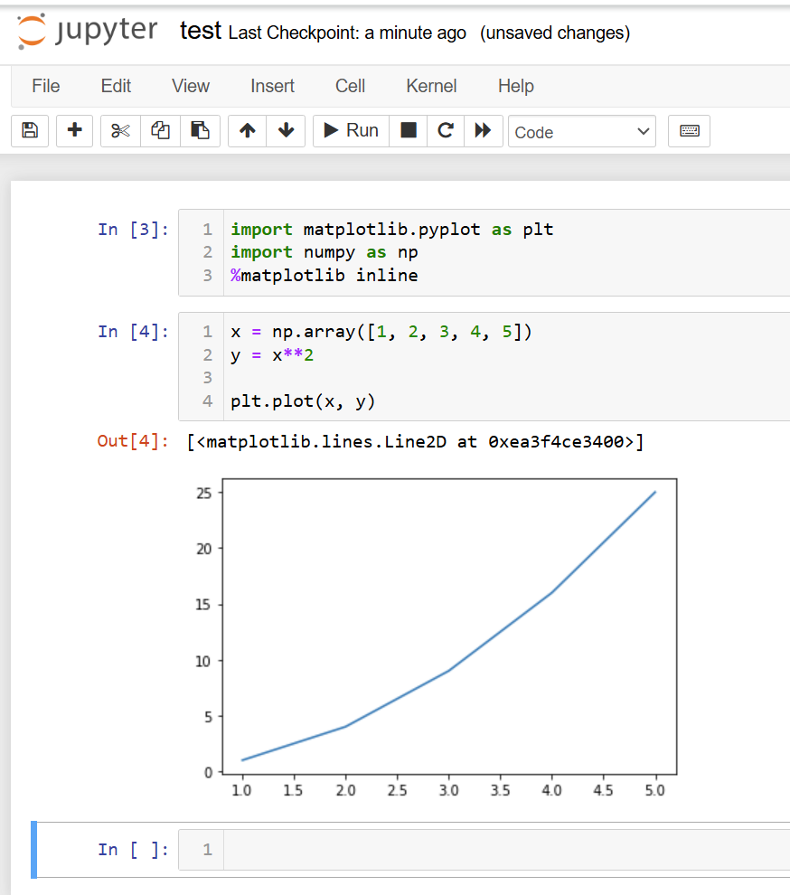

# Lab 1: Setup

## 1. Overview

In this Lab, we will overview the key setups needed for your successful participation in this course. 

You are expected to take notes and summarize the key information discussed in this class and reflect those in your first Lab report. 

As you proceed to complete the objectives, please use suitable ways (e.g. screenshots) to prove the completion of the objectives. 

The “Methodology” section of your report should contain any relevant notes about the topic – these notes are not only a part of the assignment, but also something meant to be useful to yourself. In fact, focus on doing it for yourself. Their presence and meaningful content would mean you follow the topic. The “Results and Discussion” section would contain the “proofs” of completions – e.g. screenshots of your work regarding the corresponding topics. The “discussion” part should contain your analysis or reflection on the tools’ pros and cons regarding different tasks, as well as a comparison of their capabilities for various application scenarios. In the “Conclusions”, please summarize your preferred mode of operation after you’ve learned about all the tools covered. 

The report should contain the notes/results in the following categories:

## 2. Learning content Materials/Tasks

### 2.1. Course syllabus 

**Tasks**: Read and understand the course syllabus and key expectations

**Outcomes**: Write a short summary of the key points of the syllabus

### 2.2. Writing guidelines 

**Tasks**: Read the writing/presentation expectations document "Guidelines and Rubric"

**Outcomes**: 

- Write a short summary of the key points you find important in this document 
- Start using the document template provided in the course website to prepare your report 

### 2.3. Molecular editing software

**Tasks**: Install and try using at least two of the following packages: 

- [IQMol3](http://iqmol.org/)
- [Avogadro](https://avogadro.cc/)
- [VESTA](https://jp-minerals.org/vesta/en/)
- [VMD](https://www.ks.uiuc.edu/Research/vmd/)

For most of these packages, just proceed to the “Download” page, download the code and install it to the place where you will be using it. 
For VMD, you’d need to also go through the registration step before you can access the download page. 

Construct a periodic or molecular structure, save it as a .xyz file

**Outcomes**: 

Document the steps you conducted, reflect on your experience using at least two of these pacakges - discuss their pros and cons,
provide a proof of molecular/periodic system constructed. 

### 2.4. Complete the "Intro to CCR course"

**Tasks**:

Pass the course ["Intro to CCR"](https://ublearns.buffalo.edu/d2l/le/discovery/view/course/285151) on UB Learns

**Outcomes**:

Provide the proof of a successful completion of this course to the Instructor. 

### 2.5. Accessing the cluster via Open OnDemand

**Tasks**:

Set up your CCR account, two-factor authentication (2FA) via the identity management [IDM](https://docs.ccr.buffalo.edu/en/latest/portals/idm/) portal

Be able to use the [OnDemand](https://docs.ccr.buffalo.edu/en/latest/portals/ood/) interfaces such as Terminal and File Transfer tools.

The following [link](https://akimovlab.github.io/soft_and_tuts/4.4-UBCCR_OnDemand.html) can be useful

**Outcomes**: Provide a proof of you logging into the CCR (snapshot) and running the OnDemand portal tools (snapshots)

### 2.6. Accessing the cluster via MobaXterm

**Tasks**:
Install the [MobaXterm](https://mobaxterm.mobatek.net/) 

Generate the private-public keys and add them to your CCR IDM account

Be able to access CCR using MobaXterm, use MobaXterm terminal and file transfer panel for the corresponding tasks

**Outcomes**:
Document the steps of your setup. Include the snapshots of the parameters you use in the session setup. Provide a prof of the completion (snapshot of you
logged into CCR via MobaXterm)

### 2.7. Using the Linux command line 

**Tasks**:
Learn the basic commands to get around on the Linux system. More details will be given in class. Also, these sources could be useful:
- [first link](https://docs.alliancecan.ca/wiki/Linux_introduction)
- [second linl](https://buffalo.app.box.com/s/nqj3neyt2w1dtb3gix6zxqx5gcc9x30n)

Create a hierarchical file system (nested folders) in your home directory to mimic a file organization of a potential project. As an example, this could be something like this:

    CHE330
     |--> Lab1
            |--> input.nw
            |--> molecule.xyz
     |--> Lab2
            |--> input2.nw
            |--> molecule2.xyz
            
The files can be empty or can contain something, but should be present and organized into folders (directories) and sub-folders.

**Outcomes**:
Document the key commands needed to get around on Linux system with the examples of their use (written notes). Provide a proof that you have created 
the corresponding file systems (snapshots).

### 2.8. Working with text editors 

**Tasks**:
Install and try using the following text editing software: 

Only for Windows:
- [Far3](https://www.farmanager.com/)

For Linux/Mac:
Choose any of the two – you don’t need to install them. They usually just come with the Linux/Mac system.  
- ["vim”](https://www.vim.org/) or
- [“nano”](https://www.nano-editor.org/)

Using “vim” or “nano”, create (if not present) and edit a `.bashrc` file in your home directory to prepare it for using “NWchem” or “VMD” software.

The content of this file should include the following:

    # .bashrc

    # User specific aliases and functions

    # Source global definitions
    if [ -f /etc/bashrc ]; then
            . /etc/bashrc
    fi
    if [ -f /etc/bash.bashrc ]; then
        . /etc/bash.bashrc
    fi
    # User specific aliases and functions
    # enable color support of ls and also add handy aliases
    if [ -x /usr/bin/dircolors ]; then
        test -r ~/.dircolors && eval "$(dircolors -b ~/.dircolors)" || eval "$(dircolors -b)"
        alias ls='ls --color=auto'
        alias grep='grep --color=auto'
        alias fgrep='fgrep --color=auto'
        alias egrep='egrep --color=auto'
    fi
    module use /projects/academic/cyberwksp21/MODULES
    module load libra/devel
    export PYTHONPATH=/projects/academic/cyberwksp21/SOFTWARE_NEW_ENV/libra/devel/_build/src:$PYTHONPATH
    export LD_LIBRARY_PATH=/projects/academic/cyberwksp21/SOFTWARE_NEW_ENV/libra/devel/_build/src:$LD_LIBRARY_PATH

**Outcomes**: Provide a proof of you using the tools for editing input files (snapshots). No matter what system you use on your laptop, you still
need to create a `.bashrc` file in your home directory on CCR.

### 2.9. Working with Jupyter notebooks/JupyterLab

**Tasks**:
Learn to start Jupyter or JupyterLab job on the CCR OnDemand portal (see the link above). 

Use it to generate a plot of a simple function using Python and Matplotlib as shown below

More about Jupyter can be found [here](https://jupyter.org/)

**Outcomes**:
Document the seteps needed to work with Jupyter (written). Provide a proof of you using Jupyter on the OnDemand system of CCR (snapshots) and using it
to plot a Python funcion (snapshot)

### 2.10. Submitting jobs on CCR: 

**Tasks**:
Create a submit file for running a simple “NWChem” job and submit it to be run on a cluster. 
Use the following links:
- [CCR submitting jobs](https://docs.ccr.buffalo.edu/en/latest/hpc/jobs/)
- [AkimovLab on Slurm](https://akimovlab.github.io/soft_and_tuts/4.1-slurm.html)

Please use the following example files:

`slurm.slm`

    #!/bin/bash
    #SBATCH --partition=general-compute  --qos=general-compute
    #SBATCH --clusters=ub-hpc
    #SBATCH -N 1
    #SBATCH --ntasks-per-node=6
    #SBATCH --cpus-per-task=1
    #SBATCH --time=00:10:00
    #SMATCH --mem=10000
    module load nwchem/intel/7.2.2
    mpirun -np 6 nwchem b3lyp.nw > out

and 

`b3lyp.nw`

    echo
    title "total energy of benzene, B3LYP/3-21G"

    start c6h6-b3lyp

    geometry
     C    0.99261000     0.99261000     0.00000000
     C   -1.35593048     0.36332048     0.00000000
     C    0.36332048    -1.35593048     0.00000000
     C   -0.99261000    -0.99261000     0.00000000
     C    1.35593048    -0.36332048     0.00000000
     C   -0.36332048     1.35593048     0.00000000
     H    1.75792000     1.75792000     0.00000000
     H   -2.40136338     0.64344338     0.00000000
     H    0.64344338    -2.40136338     0.00000000
     H   -1.75792000    -1.75792000     0.00000000
     H    2.40136338    -0.64344338     0.00000000
     H   -0.64344338     2.40136338     0.00000000
    end

    basis
    * library 3-21G
    end

    dft
      xc b3lyp
    end

    task dft energy

**Outcomes**:
 Provide a proof of you successfully submitting and completing the tasks (snapshots or output files)
 
