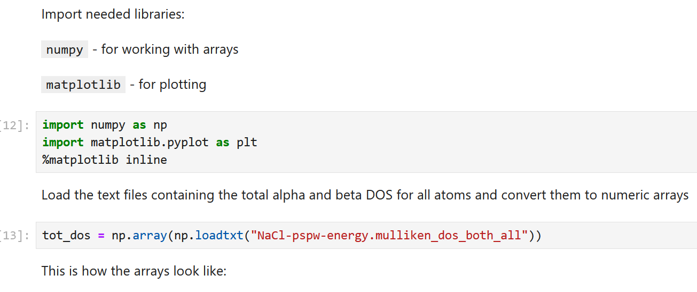

# Lab 3: Electronic Structure Calculations in Periodic Systems

## 1. Overview

In this Lab, we will learn to set up and conduct electronic structure calculations of periodic solids using the NWChem software. 
In Lab2, we used localized atomic orbital (AO) basis sets. For periodic systems, it is more suitable to use plane wave basis (PW) sets. We will study the convergence of the total energy of 
the system with respect to the kinetic energy cutoff parameter that defines the size of the PW basis. 
In addition, the periodicity of solids introduces new quantum numbers, (called k) so we are talking about so-called k-points, which also affect the orbital energies and their shapes. 
The choice of the number of k-points included in calculations is also important for obtaining the converged total energies. So, we will use it as a parameter to determine the converged properties. 
The plots of the orbital energies as a function of the k-point numbers is called the band structure. The variation of each “orbital” energy as a function of k-point quantum number gives 
it a width, the bandwidth, so the "orbital" is actually called a band. In this Lab, we will compute the band structure of some systems – rock salt and diamond.  
In Lab 2 we learned to visualize molecular orbitals stored in the Gaussian .cube files. In this Lab, we will introduce yet another method to analyze the 
composition and localization of orbitals, which can be used both for periodic and non-periodic systems. This is called density of states (DOS), and especially the partial DOS (pDOS).


## 2. Learning content Materials/Tasks


In this Lab, we will be following closely sections of Tutorials 1 and 5 from [this site](https://nwchemgit.github.io/Plane-Wave-Density-Functional-Theory.html)
In the input file, one can request the `task pspw` – this is the program for the gamma-point (single k-point) calculation on the molecular systems or periodic 
systems with large band gap (this is the criterion for when a single k-point is actually sufficient). Also, there is a `task band` – this is the program for 
solid-state systems with small gaps and metals (no gap!). It allows using more than 1 k-point in the corresponding calculations. 

### 2.1. Simple periodic structure calculation: rock salt and gold

#### 2.1.1. Convergence with respect to `cutoff`

**Tasks**: 

In analogy to the example input file for S2 dimer found on the webpage, setup the PW calculations for the rock salt, NaCl:

```
echo
title "NaCl"
start NaCl-pspw-energy
geometry center noautosym noautoz print
  Na 0.0 0.0 0.0
  Na 0.0 0.5 0.5
  Na 0.5 0.0 0.5
  Na 0.5 0.5 0.0  
  Cl 0.5 0.5 0.5
  Cl 0.5 0.0 0.0
  Cl 0.0 0.5 0.0
  Cl 0.0 0.0 0.5
 system crystal
   lat_a 5.64
   lat_b 5.64
   lat_c 5.64
   alpha 90.0
   beta  90.0
   gamma 90.0
 end
end
nwpw
  cutoff 15.0
  mult 1
  xc PBEsol-Grimme3
  monkhorst-pack 1 1 1
  lmbfgs
    ewald_rcut 3.0  
    ewald_ncut 8    #The default value of 1 needs to be increased  
end
task band energy
```
**Figure 1.** Example input for single point calculations of NaCl solid. 

- Vary the kinetic energy cutoff parameter, which defines the size of the PW basis, `cutoff`. As the value of this parameter increases,
  the total energy should become more and more negative, but should eventually converge to some value that won’t depend on the cutoff size.
  As you increase the cutoff parameter, the CPU time should be going up as well, so be mindful of the cutoff value. A good start if from 10 Ha (a.u.)
  and increasing it by 5 or 10 Ha: 10, 20, 30, … You need to use sufficient number of those to see the convergence.
  The grid of such values may be non-uniform, especially as you move to even larger cutoff values (where the effect is smaller),
  so it could be like 10, 20, … 50, 100 Ha, but be ready to stop the calculations if they are becoming too slow.
- Fill in the Table 1 with your results and discuss what value of the `cutoff` should be chosen. Argument why.
  Make sure you have about 5 points (different `cutoff` values) or more – whatever it takes to demonstrate the convergence. 


**Outcomes**:

Document your results in Table 1. 

**Table 1.** Convergence with respect to `cutoff` parameter

| Cutoff value, a.u. |  Total energy, a.u. | CPU time, sec | 
| ------- | -----------|------------|
| 10 |  |       |
| 20 |  |       |
| ... |  |   |

#### 2.1.2. Convergence with respect to k-points for semiconductors (NaCl)

**Tasks**: 

Next, we need to achieve convergence with respect to the k-points sampling. 

- Using the best value of the `cutoff` (yet, not too large to make the calculations feasible), repeat the calculations, but varying the numbers in the “monkhorst-pack” keyword.
  These should be integers, not very large, all the same. The calculation time depends strongly on the number of k-points, so be ready to also adjust your `submit.slm` file to
  increase the required time limit.

**Outcomes**:

Document your results in Table 2. 

**Table 2.** Convergence with respect to the k-points choice. Don’t go to large values if they are too slow

| Monkhorst-Pack scheme |  Total energy, a.u. | CPU time, sec | 
| ------- | -----------|------------|
| 1 x 1 x 1 |  |       |
| 2 x 2 x 2 |  |       |
| 3 x 3 x 3 |  |       |
| 4 x 4 x 4 |  |       |
| 5 x 5 x 5 |  |       |


#### 2.1.3. Convergence with respect to k-points for metals (gold)

**Tasks**: 

- Repeate the same convergence with respect to k-points study for gold. Change the geometry and crystal structure taken from [here](https://rruff.geo.arizona.edu/AMS/CIF_text_files/13362_cif.txt):

```
geometry center noautosym noautoz print
  Au 0.0 0.0 0.0
  Au 0.0 0.5 0.5
  Au 0.5 0.0 0.5
  Au 0.5 0.5 0.0  
 system crystal
   lat_a 4.07825
   lat_b 4.07825
   lat_c 4.07825
   alpha 90.0
   beta  90.0
   gamma 90.0
 end
```

**Outcomes**:

- Document your results in Table 3.
- Discuss the convergence rate wrt to k as compared to NaCl. Do you need fewer or more k-points in Au calculations?

**Table 3.** Convergence with respect to the k-points choice. Don’t go to large values if they are too slow

| Monkhorst-Pack scheme |  Total energy, a.u. | CPU time, sec | 
| ------- | -----------|------------|
| 1 x 1 x 1 |  |       |
| 2 x 2 x 2 |  |       |
| 3 x 3 x 3 |  |       |
| 4 x 4 x 4 |  |       |
| 5 x 5 x 5 |  |       |


#### 2.2. Exploration of the equilibrium geometry of NaCl

**Tasks**: 

Finally, once you determine the optimal values of the `cutoff` and `monkhorst-pack` parameters, let's explore the response of the total energy of the NaCl crystal to the crystal's 
deformation (compression, extension). The current value of lattice constants is chosen to be close to the experimental value. 
This means it should yield the lowest energy of the system. Vary the values of the lattice constants (it makes sense to set all of them to be equal to each other for every calculation) 
and report the values of the total energy. What lattice constant yields the most stable structure? 

**Outcomes**:

Document your results in Table 4. 

**Table 4.** Exploration of the equilibrium geometry of NaCl

| Lattice constant, Angstrom (`lat_a = lat_b = lat_c`) |  Total energy, a.u. | 
| ------- | -----------|
|  ...    |            |
| 5.54    |            |
|  ...    |            |


### 2.3. Partial DOS (pDOS) calculations and MO visualization.

**Examples**: 

To request pDOS calculation, add the following instructions to the “nwpw” block:
```
   Mulliken
   dos
```

also, to save the MO number 6 in the Gaussian .cube file, you can add the following instructions to the “nwpw” block:

```
   dplot
     vectors NaCl-pspw-energy.movecs
     LimitXYZ
       0.00 10.658 30
       0.00 10.658 30
       0.00 10.658 30
     orbital 16 orb16.cube
   end
```

Keep in mind that LimitXYZ section is given in atomic units (Bohr), 1 Angstrom = 1.8897265 Bohr, so 5.64 Angstrom = 10.658 Bohr. 

So, the full listing for the pDOS and orbital calculations will be:

```
echo
 title "NaCl"
 start NaCl-pspw-energy
geometry center noautosym noautoz print
  Na 0.0 0.0 0.0
  Na 0.0 0.5 0.5
  Na 0.5 0.0 0.5
  Na 0.5 0.5 0.0  
  Cl 0.5 0.5 0.5
  Cl 0.5 0.0 0.0
  Cl 0.0 0.5 0.0
  Cl 0.0 0.0 0.5
system crystal
   lat_a 5.64
   lat_b 5.64
   lat_c 5.64
   alpha 90.0
   beta  90.0
   gamma 90.0
 end
 end
 nwpw
   virtual 8             # include 8 virtual states
   cutoff 15.0
   mult 1
   xc PBEsol-Grimme3
   lmbfgs
   monkhorst-pack 1 1 1
     ewald_rcut 3.0  
     ewald_ncut 8 #The default value of 1 needs to be increased  
   Mulliken
   dos
 end

task band energy
task PSPW PSPW_DPLOT
```
**Figure 2.** Example input for single point calculations of NaCl solid, plus pDOS calculations. 


> Warning: for the orbital calculations, you'd need to use the `pspw` program, not the `band` one
> It is the program for the Gamma-point calculations only, so you don't need any Mokhorst-Pack info.
> The script will look like this

```
echo
 title "NaCl"
 start NaCl-pspw-energy
geometry center noautosym noautoz print
  Na 0.0 0.0 0.0
  Na 0.0 0.5 0.5
  Na 0.5 0.0 0.5
  Na 0.5 0.5 0.0  
  Cl 0.5 0.5 0.5
  Cl 0.5 0.0 0.0
  Cl 0.0 0.5 0.0
  Cl 0.0 0.0 0.5
system crystal
   lat_a 5.64
   lat_b 5.64
   lat_c 5.64
   alpha 90.0
   beta  90.0
   gamma 90.0
 end
 end
 nwpw
   virtual 8             # include 8 virtual states
   cutoff 15.0
   mult 1
   xc PBEsol-Grimme3
   Mulliken
   dos

   dplot
     vectors NaCl-pspw-energy.movecs
     LimitXYZ
       0.0 10.658 30
       0.0 10.658 30
       0.0 10.658 30
     orbital 16 orb16.cube
   end
 end

task PSPW energy
task PSPW PSPW_DPLOT
```
**Figure 3.** Example input for single point calculations of NaCl solid, plus the orbital visualization options. 

The example in Figure 2 also demonstrates how to request the inclusion of virtual (unoccupied) orbitals in the calculations. 
This is important in order for one to see the band gap. Without unoccupied orbitals, one would end up with only the occupied bands and will not see the gap.

**How to plot DOS and what's written in the files?**

We first read the one of generated DOS files (containing all the projections - on s and p componentes, for both alpha and beta electrons, for all atoms) using numpy:



Also, check out [this S2 example](s2_example) In particular, you can use the visualization/plotting Jupyter notebook (also shown as a PDF file) for plotting the pDOS.

**Tasks**:

- Visualize HOMO and LUMO of NaCl solid and show them as panels of a figure in your report.
  The .cube files produced can be visualized as in Lab 2. For this Lab, note that the periodicity will need to be included when visualizing orbitals and the system using VMD. 
- Using the Python script provided (Jupyter notebook), plot the total DOS, orbital- and atom- resolved pDOS. Show them as panels of a figure in your report.
  You may need to adapt the provided code a little bit in order to accomplish this task. What can you tell about the composition of the frontier bands (orbitals) based on the pDOS analysis?
  What kind of "AO"s compose these "MO"s? On what atoms are they localized? Do your conclusions match what you see in the orbital visualization?
- Repeat your pDOS calculations but now using a larger grid of k-points, say 6x6x6. Is the pDOS sensitive to the choice of the k-point number?
- Use the example [input provided on the NWChem website](https://nwchemgit.github.io/Plane-Wave-Density-Functional-Theory.html#using-band-to-calculate-the-band-structures-of-diamond)
  in this section  to compute the pDOS of diamond.
- Compute total DOS of diamond for two k-points grids – 1x1x1 and say 6x6x6 (note – example uses 9x9x9). Is DOS of diamond more sensitive to the choice of the k-points grid than it is in the NaCl case? 

