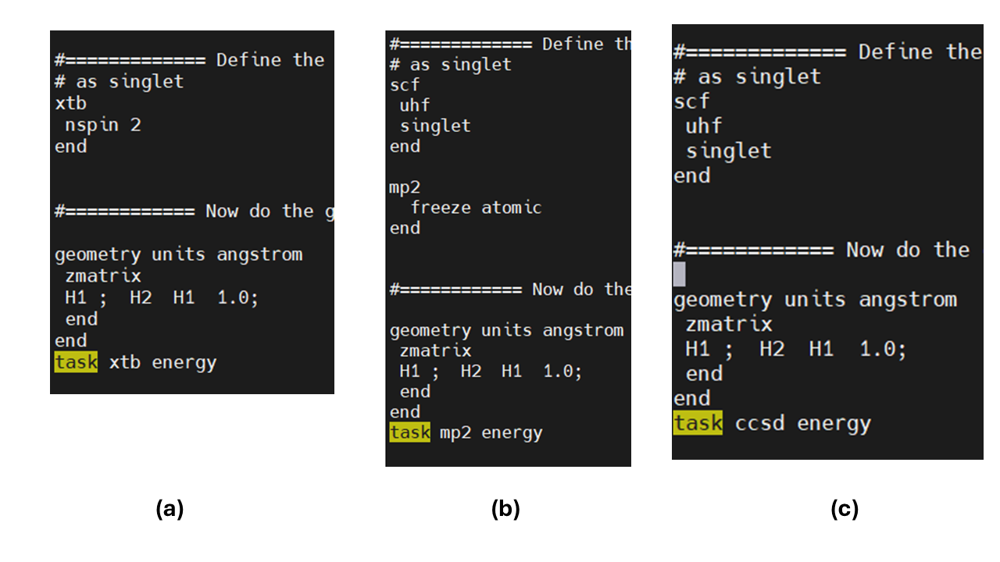
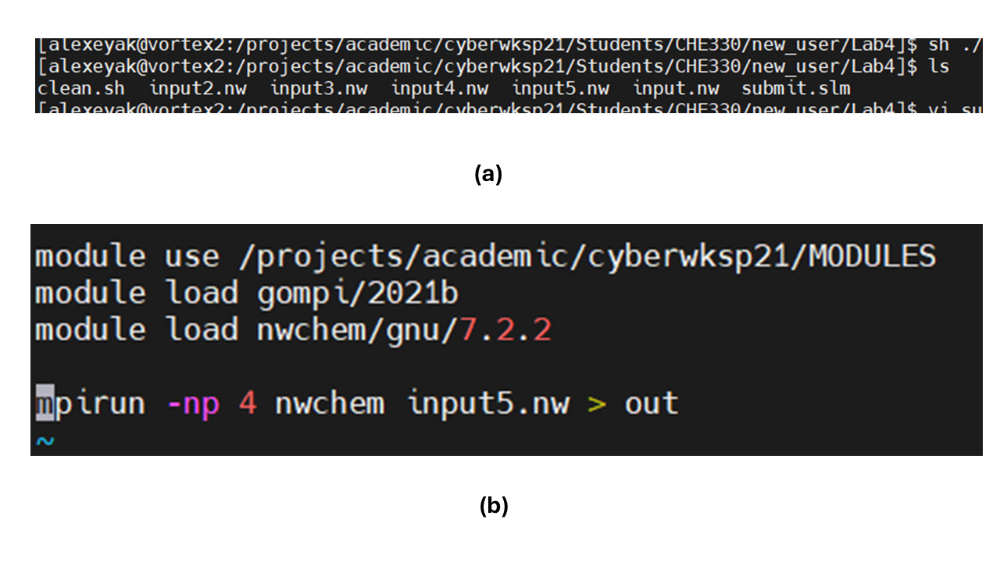
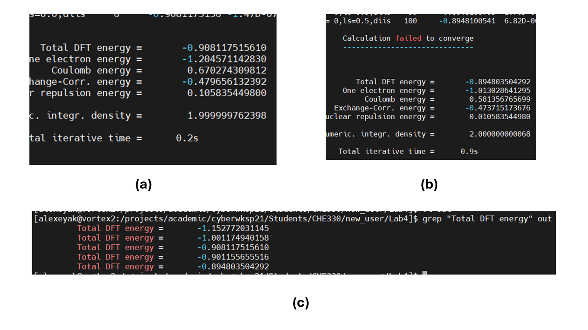
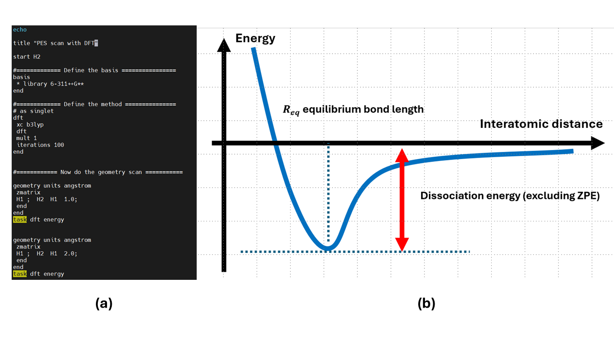

# Lab 4: Potential Energy Surfaces of $H_2$ and $H_2^+$ Molecules. Bond Dissociation Energies and Electronic Correlation.

## 1. Overview

In this Lab, we will explore the potential energy surfaces (PESs) of the simplest diatomic molecules - $H_2$ and $H_2^+$. The first molecule has only 2 electrons and the second – only one. 
Thus, for the first molecule the electronic correlation is important, while for the second one – no electronic correlation is present. The PES is the system’s total energy, E, as a function of the system’s coordinates, R, 
that is $E=E(R)$. For a diatomic molecule, only 1 internal nuclear coordinate is of importance – the interatomic distance. Thus, for diatomic molecules we really just talk about the 
potential energy profile, not the surface, although the term PES is still often applied considering that the “profile” is just a special case of the “surface”. 

## 2. Learning content Materials/Tasks

### 2.1 Methodology and Tools

The following references may be useful for this lab:
- [xTB](https://nwchemgit.github.io/XTB.html)
- [HF](https://nwchemgit.github.io/Hartree-Fock-Theory-for-Molecules.html)
- [DFT](https://nwchemgit.github.io/Density-Functional-Theory-for-Molecules.html)
- [MP2](https://nwchemgit.github.io/MP2.html)
- [CCSD](https://nwchemgit.github.io/CCSD.html)

Specifically, some examples of setting up xTB, MP2, and CCSD calculations (these are only snippets, not the complete examples of the input scripts) are shown in Figure 1:

**Figure 1.** The snippets requesting (a) xTB; (b) MP2; and (c) CCSD calculations. 

In addition, I recommend defining several input files so that you keep it all more-or-less organized and submitting the corresponding calculations as needed (Figure 2):

**Figure 2.** Hints on organizing your calculations: (a) A possible way to separate calculations is to prepare several input files – the first one focusing on xTB, 
next – on HF and so on; (b) when you want to submit the calculation for a given method, just change the name of the NWChem input file in your submit script 
(in this case, we will use “input5.nw”). You may want to call the input files a more meaningful names such as “input_xtb.nw” or “input_ccsd.nw”. 
You may also want to rename the generic “out” output file to something like “out_xtb” or “out_ccsd”, to keep all results not overridden. 

Since your script may generate the output with energies for multiple points, looking for them may be not very convenient and error-prone. Instead, I recommend 
using the “grep” command to find all the matches to a given pattern (Figure 3):

**Figure 3.** Using “grep” to look for energies in your output: (a) identify the pattern containing the energy of interest – in this case 
it will be “Total DFT energy”, but beware – it may be different for other methods; (b) make sure to overview the output to find the results for non-converged 
calculation: you may still be finding some energy value, but it should be taken with a big grain of salt since the calculations aren’t converged; 
(c) as a result of the “grep” command run on the appropriate output file (in this case, called “out”, but may be different in your case), you 
should be able to get a list of numbers that you can later use for PES plotting. 

### 2.2 Tasks and Outcomes

**Tasks**:

In this Lab, our first goal will be to **construct the PESs for both molecules, using several methods**: xTB (semiempirical), HF, B3LYP (DFT), and the methods that introduce so-called **non-dynamic correlation** – MP2 and CCSD. The hybrid B3LYP functional does not have non-dynamic correlation as MP2 or CCSD, but it introduced a **dynamical correlation** of electrons. 
In principle, one can combine DFT methods with MP2 or CCSD, within the so-called double-hybrid approaches, but we will not be doing it in this Lab. We will use a sufficiently large basis set, 6-311++G**, from the very beginning not to worry about the possible sources of error due to the basis set size effects. Remember that for the $H_2$ molecule, we should be looking for a singlet wavefunction and for the $H_2^+$ - for a doublet. 

**Figure 4.** (a) Example input file for H2 PES scan at the B3LYP/6-311++G** level of theory. The DFT calculations are conducted only for 2 internuclear distances in this example: R=1.0 Å and R=2.0 Å. (b) Anticipated Morse-type shape of the PES for diatomic molecules. 

For plotting PES, you will need to repeat the calculations multiple times. I recommend defining the method and basis set in the beginning of your input file and then repeating 
the update of geometry and call of the calculations as many times as needed (Figure 4a). The example in Figure 1 shows only 2 points, but you should repeat the calculations for more points
in order to capture the Morse-like shape of the PES (Figure 4b) and obtain a sufficiently smooth curve. Be sure to include at least one point with a very large interatomic distance (e.g. 50 Angstrom), but beware – for some methods, such calculations may not converge. Your main result should be a figure composed of 3 panels: the top row for the 
restricted calculations and the bottom row for the unrestricted calculations; the left column for $H_2$ molecule and the right column for the $H_2^+$ molecule. 
Since $H_2^+$ is a doublet, restricted calculations are not possible for it (except for resticted-open shell). 
Thant’s why you will have only 3 panels, not 4. Plot the PES curves obtained with different methods on the same panel, just using different colors/line type. 
Be sure to also include enough points around the energy minimum, to better locate it, but you don’t have to do it super-accurately. A good grid of distances could be:
0.3, 0.4, 0.6, 0.7, 0.8, 1.0, 1.2, 1.5, 2.0, 3.0, 4.0, 5.0, 6.0, 7.0, 8.0, 9.0, 10.0 and 50.0 Angstrom.

Once you have computed the PESs, compute the bond dissociation energy (Figure 4b, red double arrow) for each molecule. 
Report your results in a Table. Compare your results to the reference values from the literature (see the numbers in the Table 1 I have found for you). 

**Outcomes**:

- Complete the figure (PES scans of $H_2$ and $H_2^+$ molecules computed with different methods) with the results of your PES scan calculations for both molecules and
  all methods

- Complete the following table summarizing the bond dissociation energy of each molecule as computed with all the methods. Compare to the reference values

**Table 1.** Bond dissociation energy
| Method	|  H2   |  	H2+    |	Your comments on the method’s applicability to the bond dissociation problem |
| ---     | ---   | ----     | ----                                                                          |
| Reference |	4.48 eV [1] | 2.8 eV [2], 2.65 eV [3] |                                            |
| xTB, restricted |     |       |          |
| xTB, unrestricted |     |       |          |
| HF, restricted |     |       |          |
| HF, unrestricted |     |       |          |
| B3LYP, restricted |     |       |          |
| B3LYP, unrestricted |     |       |          |
| MP2, restricted |     |       |          |
| MP2, unrestricted |     |       |          |
| CCSD, restricted |     |       |          |
| CCSD, unrestricted |     |       |          |

- Based on the results of your calculations, discuss the following:
  
     -	which method gives you the best agreement with the experiment? 

     -	do you have any problems with the convergence? for what methods and interatomic distances do you have such problems? 
what does it tell you about the applicability of such methods to the bond dissociation problem? 
Comment on it in the last column of your Table 1. This may be something like “it doesn’t work at all”, “it works, but doesn’t provide a good value”, 
“it yields a very accurate result”, but feel free to come up with your own description.

     -	are there any differences between restricted and unrestricted calculations as far as the convergence and the shape 
(including the bond dissociation energy) of the PES is concerned?

     -	for the $H_2$ molecule, the correct dissociation limit is to form two neutral H atoms. From the quantum mechanics course, 
you may (or will) learn that the energy of a single H atom should be -0.5 Ha exactly. This is one of those few problems that quantum mechanics 
can solve exactly. Based on this information and the results of your calculations, what can you tell about the ability of different methods 
to predict the correct energy of two non-interacting (that is separated by a very large distance) H atoms?

    -	is the performance of the non-correlated methods better in the case of $H_2$ or $H_2^+$. Why?

### 2.3 References

- [1] Herzberg, G.; Monfils, A. The Dissociation Energies of the H2, HD, and D2 Molecules. J. Mol. Spectrosc. 1961, 5 (1), 482–498. https://doi.org/10.1016/0022-2852(61)90111-4.
- [2] 10.4: The Case of H₂+. Chemistry LibreTexts. https://chem.libretexts.org/Bookshelves/Physical_and_Theoretical_Chemistry_Textbook_Maps/Book%3A_Quantum_States_of_Atoms_and_Molecules_(Zielinksi_et_al)/10%3A_Theories_of_Electronic_Molecular_Structure/10.04%3A_The_Case_of_H (accessed 2024-02-24)
- [3] Bishop, D. M. Non-Adiabatic Calculations for H2 +, HD+ and D2 +. Mol. Phys. 1974, 28 (6), 1397–1408. https://doi.org/10.1080/00268977400102681.
