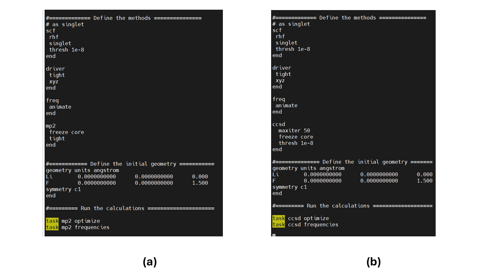

# Lab 5: Geometry Optimization and Vibrational Frequencies

## 1. Overview

In this Lab, we will use quantum chemical calculations **to find the optimal geometries of small molecules**: the geometries that minimize the molecules' energies (Figure 1). 
You should be already familiar with the concept – in Lab2, we pre-optimized molecules but using force fields; in Lab 3, we looked for the optimal lattice constants of solid, but manually;
and in Lab 4, we scanned the whole PES of diatomics and could have located the optimal structures by finding the minima of the potential energies. 

Now, it is time to unleash the power of quantum chemistry and make the optimization algorithm find it for you automatically.

**Figure 1.** Key ideas for geometry optimization and vibrational frequency calculations. ZPE = zero-point energy.

Figure 1 illustrates the potential energy surface (PES) of a hypothetic diatomic molecule. This is something we have been constructing in Lab 4. 
One can start with a guess geometry of the diatomic molecule (red sphere – the internuclear distance is too short; blue sphere - the internuclear distance is too long). 
This geometry has an excess of energy compared to the optimal geometry (green sphere). The optimization algorithm uses the gradients of the PES (tangents computed at every point of the search path) 
to determine the direction in which to displace the coordinate (red – make the bond longer; blue – make it shorter) and the magnitude of such a displacement (the steeper slope means a larger displacement). 
This algorithm is repeated until no further change of geometry is predicted (the convergence). Note that one doesn’t need to know the whole PES to conduct the optimization – only the gradients at the 
intermediate geometries are needed. Figure 1 illustrates only an effective 1-dimensional problem. Real molecules are more complex (many atoms), so the PES is a multidimensional object, 
which is hard to visualize. What people do in this case – they study the 1D or 2D cuts (profiles/surfaces) of the actual PESs: all degrees of freedom but 1 or 2 are frozen in this case. 
But let’s not diverge – in this Lab, we don’t need the PES surfaces or profiles, we only need the optimal geometries and the energies at such geometries. 

Once the geometry is found, one can look to compute some useful properties of the molecules. One of them is the molecular vibrational spectrum (usually what experimentalists associate with the IR spectra, 
although one can also request the Raman spectra as well). This is done by conducting the normal modes analysis. In short, a Hessian matrix (Hessian - all mixed second derivatives 
of the system’s energy with respect to nuclear degrees of freedom) is computed and diagonalized to determine the corresponding eigenvalues ($\omega_i^2$) and the eigenvectors ($h_i$) – **the normal modes**. 
Note that **the eigenvalues of the Hessian matrix** are given by squares of the corresponding frequencies and therefore **should not be negative!** 
**If they are negative, it is likely because the geometry has not converged to the true minimum** of the PES. Thus, a high accuracy (**tight convergence** criteria) is usually required before 
the normal modes analysis could be applied. Another situation when the Hessian eigenvalues may be negative is when we are looking at the **saddle point** geometry, as is the case for chemical 
reaction pathways (e.g. transition states), but this is a topic of the next Lab. 

The normal mode, $h_i$, can be regarded as a collective vibrational motion of all atoms in the system. Different modes represent different kinds of such combinations. 
Each mode may involve a combination of primitive types of motions such as bond stretch vibrations, angle bending vibrations, inversions, and so on. Frequencies and (their corresponding) 
modes are indexed by an integer representing the index of the mode. For a system of N atoms, there are 3N-6 (non-linear molecule) or 3N-5 (linear molecule) internal degrees of freedom. 
This is the number of frequencies you should expect for your molecule. The remaining 6 or 5 degrees of freedom are actually the trivial coordinates representing 3 translations of 
the center of mass of the molecule and 3 (non-linear) or 2 (linear) rotations of the whole molecule as rigid body. These trivial coordinates can be regarded as the modes with zero frequency. 
Just to reiterate, for a diatomic molecule (N = 2), there will be `3*N-5 =1` non-trivial modes; for the tetratomic molecule  (N = 4), there will be 3*N-6 = 6 non-trivial modes, and so on. 

## 2. Objectives and Tasks

As in this Lab, we will be using **several methods**: xTB (semiempirical), HF, B3LYP (DFT), MP2 and CCSD. 
We will use a sufficiently large basis set (although not exhaustive still), 6-311++G**, and hope it can still yield reasonable results. We will apply these methods 
to compute the structures and frequencies of two small molecules: LiF and LiF-LiF (Figure 2). Our reference for these systems will be the work of Grein[1] who conducted such 
calculations for a number of such complexes. Let's see if we could get something close to what this author obtained for these systems.  

**Figure 2.** Structure of the LiF-LiF complex from work of Grein.

The computational setup for the systems could be something like in Figure 3. Note the following additions: 

1. in the “scf” section, we request higher accuracy of the convergence `thresh 1e-8` so that we can compute more accurate forces;
2. the “driver” section controls the process of optimization: the option `tight` here controls the degree of convergence 
   of the optimal geometry search – it sets the gradient magnitude needed to achieve convergence of nuclear iterations (this is different convergence criterion from the SCF convergence). 
It is important to get more closely to the true energy minimum so that we don’t get imaginary frequencies;
3. the `xyz` option in the “driver” will produce the history of the geometry optimization in .xyz files for each nuclear iteration – this may be a convenient option to obtain
   the xyz file for the optimized geometry, just pick the last file in the series. E.g. the example script in Figure 3 would produce files `LiF-000.xyz`, `LiF-001.xyz`, etc.
   These are the geometry optimization steps;
4. the “freq” block has the ”animate” keyword. This keyword will generate the .xyz files containing 20-step animation of the full swing of one oscillation according to all normal modes.
   For instance, the input script in Figure 3 will generate the following files: “freq.m-001.xyz”, … “freq.m-006.xyz” – these are the animations of all 6 normal modes.
   You can load these files into VMD to see what kind of motion those are;
5. we use the `task scf optimize` and `task scf frequencies` to first search for the optimal geometry and then compute the normal modes at the final geometry. The order of these operations matters a lot! 

**Figure 3.** Example input file for geometry optimization and frequencies calculation of LiF molecule using HF/6-311++G** method. 

## 3. Methodology and Tools

The following references may be useful for this lab:

* [Optimization](https://nwchemgit.github.io/Geometry-Optimization.html)
* [Frequencies/Normal modes calculations](https://nwchemgit.github.io/Hessians-and-Vibrational-Frequencies.html)
* [xTB](https://nwchemgit.github.io/XTB.html)
* [HF](https://nwchemgit.github.io/Hartree-Fock-Theory-for-Molecules.html)
* [DFT](https://nwchemgit.github.io/Density-Functional-Theory-for-Molecules.html)
* [MP2](https://nwchemgit.github.io/MP2.html)
* [CCSD](https://nwchemgit.github.io/CCSD.html)
  
Specifically, some examples of setting up MP2 and CCSD calculations (these are only snippets, not the complete examples of the input scripts) are shown in Figure 4

**Figure 4.** The snippets requesting (a) MP2 and (b) CCSD calculations.

Once your frequency calculations are complete, look for the corresponding frequency values in the output (e.g. Figure 5).

**Figure 5.** An example of the frequency output. The “Eigenvalue” is the actual value of the frequency. Note there are 5 trivial modes for the diatomic molecule, which can be excluded. 

