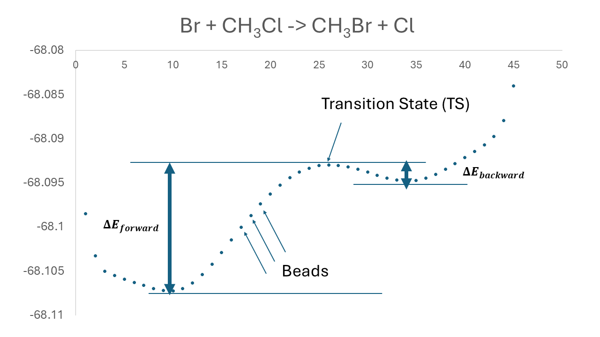
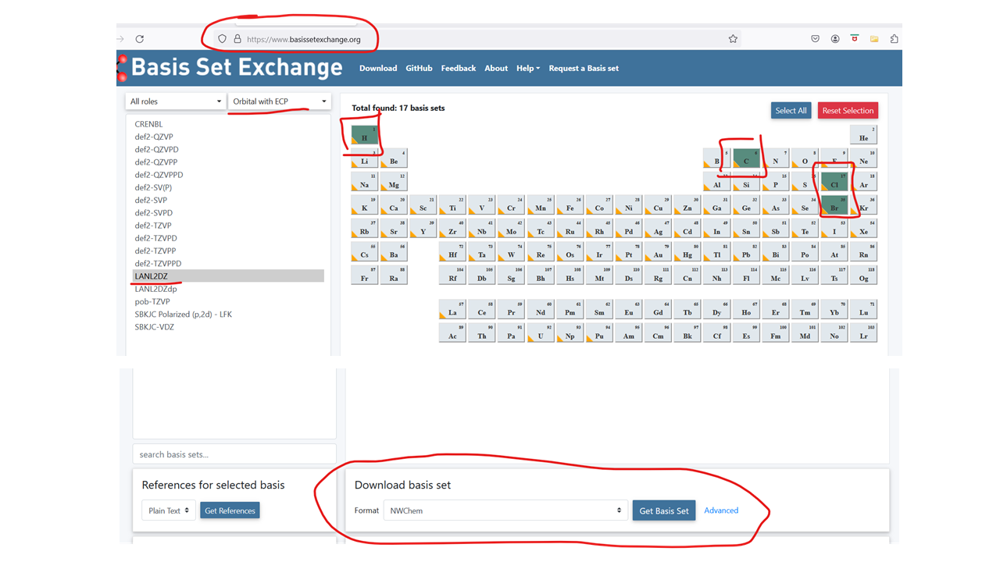
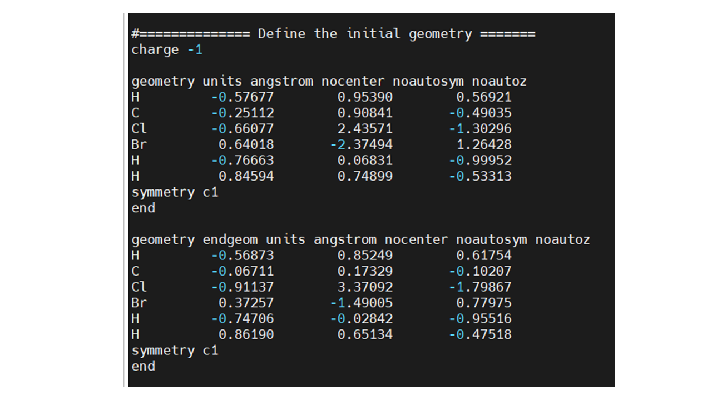
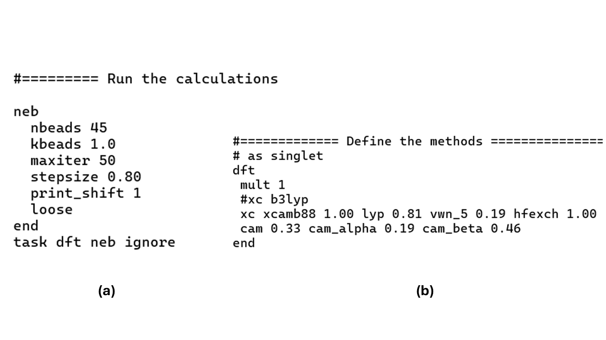
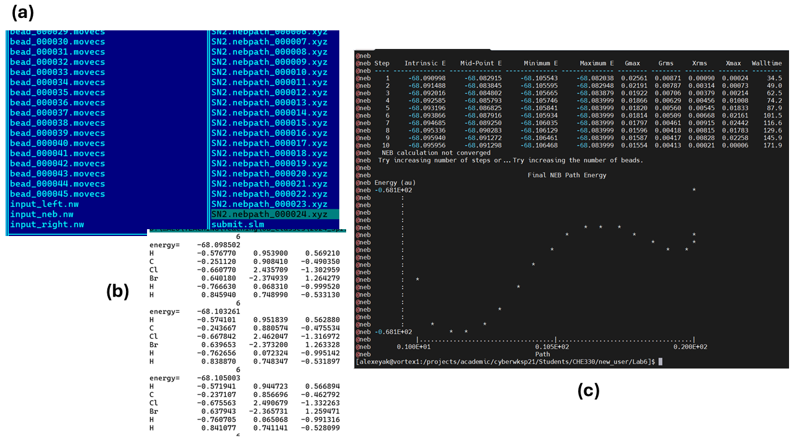
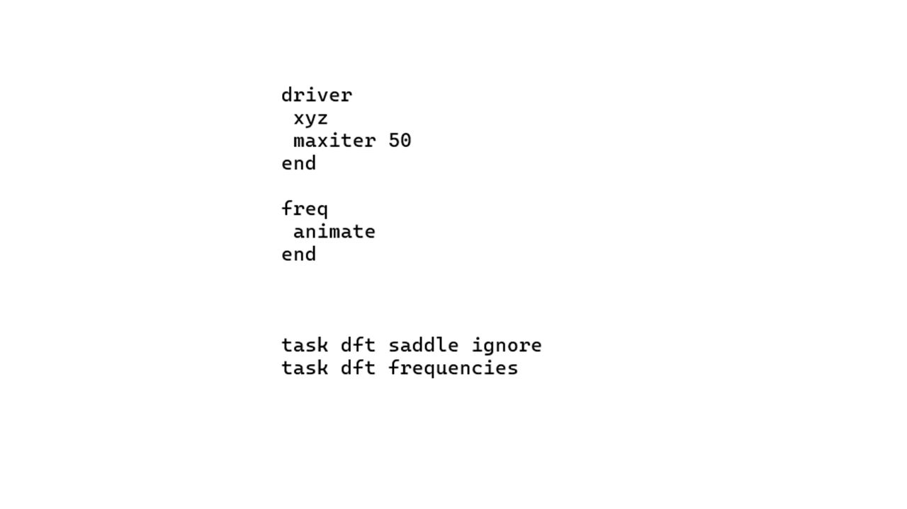

# Lab 6: Reaction Coordinate Profiles: $S_N2$ Reaction Barrier

## 1. Overview

In this Lab, we will be exploring the energy profile of an $S_N2$ reaction: $Cl^{-} + CH_3 Br ↔ CH_3Cl+Br^{-}$ (Figure 1). 
To do this, we will be using the so-called the **nudged elastic band (NEB)** method. In short, one can imagine exploring the topology of a mountain pass 
using a stretchable rope: given the positions of the end points (start and finish), the rope would align with the barrier path yet finding 
the minimum energy along all other directions. In our case, the rope is made of molecular geometries (snapshots or **beads**) that interpolate 
between the given **end points**. The beads are connected to each other by “springs“ (controlled by the `kbeads` force constant parameter in the input file) 
so that the rope has some “tension” and hence doesn’t end up in the unnecessary regions of higher energy. If it would, the resulting path would not be the 
minimum energy path between the two points. The number of beads is one of the key control parameters in the NEB calculations: the larger number of beads 
would result in a better-resolved and more accurate reaction energy profiles, but it would also increase the cost of simulations. 
Every iteration of the NEB calculations requires computing `nbeads` single point energies and gradients. Thus, it is **recommended to use a larger number 
of processors** and increase the time limit of your jobs, especially when using the more expensive levels of theory (larger basis sets, correlated methods). 

**Figure 1.** Reaction energy profile for $Br^{-} + CH_3 Cl ↔ CH_3 Br + Cl^{-}$ reaction computed at the B3LYP/LANL2DZ level of theory. The 45 beads are used in this 
calculation, but it is not yet fully converged (although pretty close to it). Note that this picture is given only for your reference. 

## 2. Objectives and Tasks

For the reaction we are going to explore, the endpoints correspond to the geometries where either $Cl^-$ or $Br^-$ ions are sufficiently distant from 
the central carbon atom and can be regarded as dissociated. The path connecting these points will go through the barrier. The configuration with the 
highest energy is the transition state (TS) (topologically, it is called a **saddle point**). If you run the normal modes calculations, you would get 
one of the frequencies being imaginary ($ω^2<0$). This mode corresponds to passing the TS along the reaction coordinate. In fact, the reaction coordinate 
will correspond to a concerted motion of halogens, where the $Cl^-$ ion is incoming toward the carbon atom, and $Br^-$ is leaving at the same time. 

Our goals in this Lab will be:
1. 	to compute the energy profiles and energy barriers for the forward and backward reactions (these terms are relative to how to write down the reaction,
    $Cl^-+CH_3 Br↔CH_3 Cl+Br^-$ or $Br^-+CH_3 Br↔CH_3 Cl+Cl^-$ ) using several methods: xTB, HF, B3LYP, and CAM-B3LYP.
   	For HF, B3LYP, and CAM-B3LYP we will be using the LANL2DZ with the **effective core potential (ECP)**. For simplicity, we will disregard the ZPE
   	contributions to such quantities; 
2. find and characterize the structure and vibrations of the transition state for every level of theory.

## 3. Methodology and Tools

### 3.1. Useful resources
The following references may be useful for this lab:
- [Frequencies/Normal modes calculations](https://nwchemgit.github.io/Hessians-and-Vibrational-Frequencies.html)
- [xTB](https://nwchemgit.github.io/XTB.html)
- [HF](https://nwchemgit.github.io/Hartree-Fock-Theory-for-Molecules.html)
- [DFT](https://nwchemgit.github.io/Density-Functional-Theory-for-Molecules.html)

### 3.2. Execution steps

**Setting up the basis with ECP**

In this Lab, the system that we will be studying contains heavy element bromine. Although more common basis sets such as 6-311G** are still available 
for this element, they would include a bit of extra electrons from Br atom in the calculations and will make our calculations slow. 
Instead, we can use the **effective core potential (ECP)** that treats the core electrons implicitly so the Br atom will not include 
as many electrons in the calculations as in the 6-311G** basis. In addition, the LANL2DZ basis is known to be quite a good quality basis. 
To get the basis and the ECP for all elements that we have in the system (Figure 2):

1)	go to the basis set exchange webpage [https://www.basissetexchange.org/](https://www.basissetexchange.org/)
2)	select H, C, Cl and Br atoms;
3)	select “Orbital with ECP”;
4)	select the “LANL2DZ” basis set;
5)	in the bottom, select the NWChem format and download click “Get Basis Set” button;
6)	copy and paste the content of the opened window/document into your input file;

**Figure 2**. How to get the LANL2DZ basis function with ECP for H, C, Cl and Br atoms. 

**Setting up the geometries**

Use [this page](https://nwchemgit.github.io/Nudged-Elastic-Band-and-Zero-Temperature-String-Methods.html) for the NEB reference.

The NEB calculations require two geometries – the starting and the end geometries. For simplicity, I provide you with the two reasonable 
end points – the files “Br-CClH3.xyz” and “Cl-CBrH3.xyz” files, although these points may be improved. These geometries correspond to having 
one of the halogen atoms separated from the rest of the system by a longer distance (not infinity, to avoid the problems with convergence) and being on the Cl-C-Br line, 
while having the rest of the system optimized with the UFF force field. You can input these coordinates in the NWChem input file as shown in Figure 3. 

**Figure 3**. The portion of the input file that describes the start (Br + CH3Cl) and end (Cl + CH3Br) geometries. 
If you want consider the opposite reaction (Cl attack) as the forward, just put the `endgeom` keyword in the first block. 

**Setting up the calculations**

First of all, although we describe the reaction as having the charge localized either on Cl or Br anions, in quantum mechanical calculations 
we only need to define the overall charge of the system (which is -1, as you can also see in the portion of the input file shown in Figure 3) and hope that the quantum mechanical 
method would be able to correctly describe the charge redistribution as the reaction goes. 

The NEB calculations are requested by the `task dft neb` with the `neb` block defining the key parameters of the `neb` calculations (Figure 4)

**Figure 4**. Setting up the NEB calculations with the DFT. a) NEB calculations requesting calculations with 45 beads, 50 maximal NEB cycles, 
loose convergence criterion; b) the dft block that sets up B3LYP (commented line) or CAM-B3LYP (uncommented lines) calculations.

In your calculations, I recommend using about **30 beads** (not 45 as in the example), unless you have difficulties with the convergence. 

**Outputs of the NEB calculations**

The NEB calculations will produce a lot of files (Figure 5a). There will be `nbeads` files with the MO vectors (left of Figure 5a) – because the NEB will 
be doing that many single point calculations at every NEB iteration. Also, there will be `maxiter` (or less if converged earlier) files `<prefix>.nebpath_0000*.xyz`. 
The `<prefix>` refers to the how you call the job in the input file (“SN2” for me) and `*` means "anything" (any numbers in my case). The larger the number of in the `nebpath` file, 
the later the iteration of the calculations is, the closer the corresponding path is to the converged one. In the example Figure 5a, the convergence might have been achieved at the NEB iteration 24. 

Every “nebpath” file is an xyz file that contains the geometry snapshots of every bead of the “rope”, with the corresponding energies (Figure 5b). 
You can use these energies to estimate the energy barriers. Also, there will be your typical output file. In my case, it is called “out_neb”. 
It contains a lot of information, so using `grep` command on it is not that straightforward. However, you can use `grep @ out_neb` (change the `out_neb` part according to how your file is 
actually called) to check the convergence of the NEB calculations (Figure 5c). As a bonus, it will also print a very primitive plot of the reaction energy profile, 
just to give you an idea of how it may look like (compare to what you see in Figure 1). 

**Figure 5**. Outputs of the NEB calculation. a) some of the files produced; b) the content (part of) of the “nebpath” files; c) output of the `grep @ out_neb` command. 

**Setting saddle point search and vibrational analysis calculations**

Once the NEB calculations are complete, you can search for the TS structure and compute the reactive coordinate. The relevant input snippets are shown in Figure 6. 
The setup is similar to the optimization procedure, but you just use `saddle` instead of `optimize` in the corresponding `task` line. Make sure to set the initial 
geometry close to the TS point found in the NEB calculation (based on the analysis of the energy in the “nebpath” file).

**Figure 6**. Input snippet for setting up the TS search followed by the frequency calculations.

The output for such calculations will be as that in Lab 5, but there should be one mode with a negative frequency 
(in fact, this is an imaginary frequency, but in the output, it is just made negative to mark the difference). Load the corresponding mode visualization 
into VMD and characterize what kind of motion it is. Document the found frequencies.

## 4. Results and Discussions

The main results of the Lab would be summarized in Table 1:

**Table 1.** Reaction energy profile for the $Cl^-+CH_3 Br→CH_3 Cl+Br^-$ reaction.

| Method  |  ΔE_forward, kcal/mol  | ΔE_backward, kcal/mol | Imaginary frequency, cm^-1  |
| ---     | ---                    | ---                   | ---                         |
| Reference[1], CCSD(T)/aug-cc-pVTZ | 9.6 kcal/mol |  14.4 kcal/mol	N/A |      N/A        |
| xTB |     |       |      |
| HF |     |       |      |
| B3LYP |     |       |      |
| CAM-B3LYP |     |       |      |

## 5. References

[1] Valverde, D.; Georg, H. C.; Canuto, S. Free-Energy Landscape of the SN2 Reaction CH3Br + Cl- → CH3Cl + Br- in Different Liquid Environments. J. Phys. Chem. B 2022, 126 (20), 3685–3692. https://doi.org/10.1021/acs.jpcb.1c10282.

