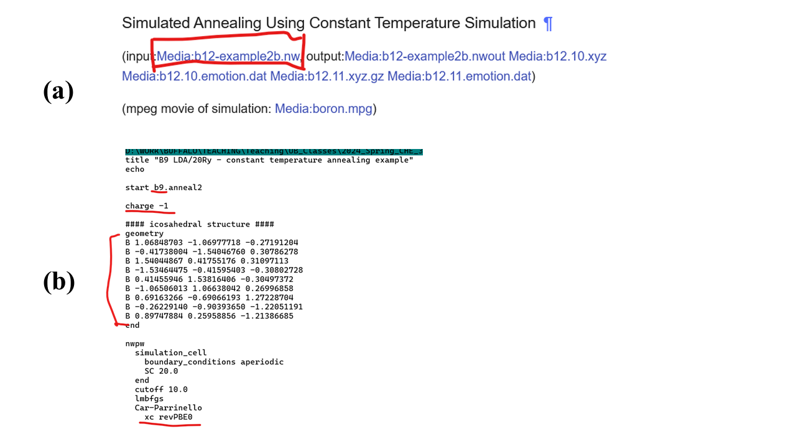
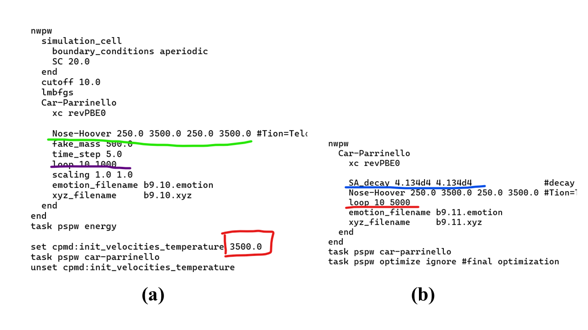
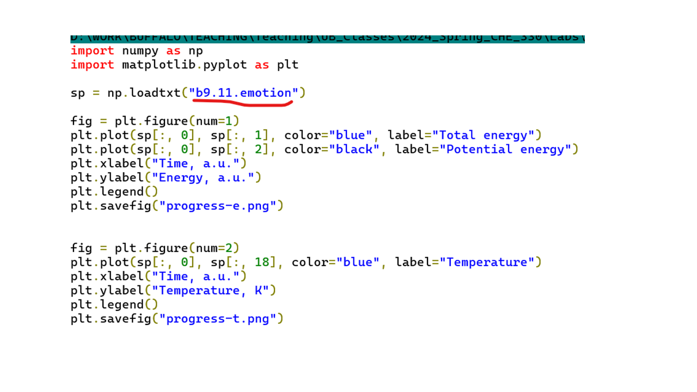
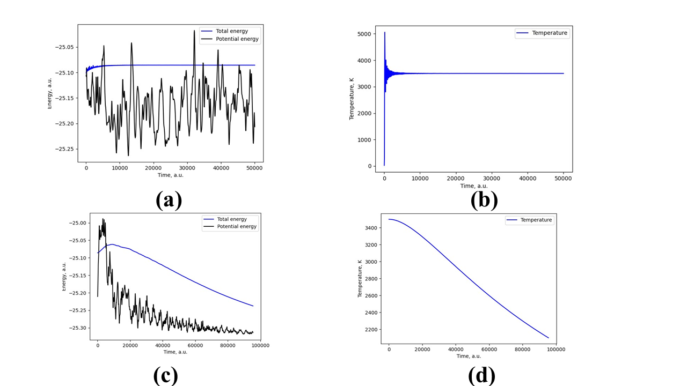
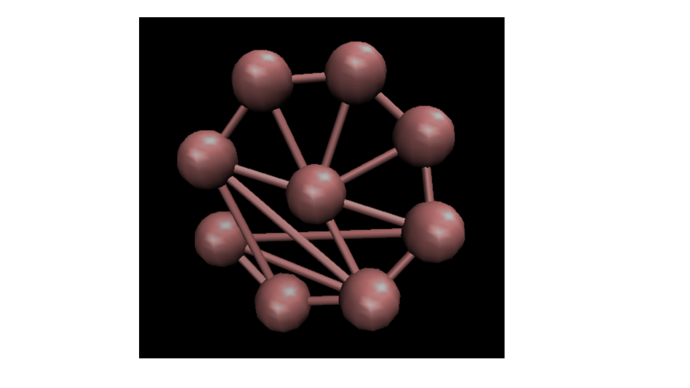

# Lab 8: Molecular Dynamics and Global Minima Search

## 1. Overview

### 1.1. Basic theory of MD.

In this Lab, we will conduct classical **molecular dynamics (MD)** simulations of some molecular systems. 
The goal of the MD simulations is obtaining **"molecular movies"**, also known as **trajectories** – the sequence of geometries reflecting 
how the atoms evolve according to Newtonian dynamics. The key equations here are:

$$ v_{i,\alpha} = \frac{dr_{i,\alpha}}{dt} = \frac{ p_{i,\alpha} }{ m_i}    Eq. 1$$

$$  m_i a_{i,\alpha} = \frac{dp_{i,\alpha}}{dt} = F_{i,\alpha}(r_{1,x}, r_{1,y}, r_{1,z},...,r_{N,x},r_{N,y},r_{N,z})    Eq. 2$$

Here, $i=1,...,N$ is the atom index, $\alpha = x, y, z$ is the index of the projection, $r$ – coordinates, $p$ – momenta, $F$ – forces, 
$v$ - velocity, $a$ - acceleration, $m$ – masses of particles.
Pay attention to the indices: $F_{i,\alpha}(r_{1,x}, r_{1,y}, r_{1,z},..., r_{N,x}, r_{N,y}, r_{N,z} )$ indicates the $\alpha$-th projection of force on atom i. 
Since the interactions are often complex (non-separable), such a force component can in principle depend on **all the coordinates of all atoms**. It is convenient 
to combine all coordinates, momenta and forces in vectors: $\mathbf r = (r_{1,x}, r_{1,y}, r_{1,z},..., r_{N,x}, r_{N,y}, r_{N,z} )$, 
$\mathbf p = (p_{1,x}, p_{1,y}, p_{1,z},..., p_{N,x}, p_{N,y}, p_{N,z} )$ or $\mathbf F = (F_{1,x}, F_{1,y}, F_{1,z},..., F_{N,x}, F_{N,y}, F_{N,z} )$. 

Thus, the goal of MD is to solve the above equations of motion in order to obtain trajectories – the sequences of geometries and momenta for different 
timesteps: $(\mathbf r(t_0 ), \mathbf p(t_0 )), (\mathbf r(t_1 ), \mathbf p(t_1 )),..., (\mathbf r(t_T ), \mathbf p(t_T ))$. Often, we mainly focus on the coordinates, 
so often one understands the word “trajectory” as the sequence of coordinates only, that is: $(\mathbf r(t_0 ), \mathbf r(t_1 ),..., \mathbf r(t_T ) )$. This is what is usually 
stored in the xyz trajectory files, although NWChem also stores the momenta. This is what can be loaded into VMD to generate the **"molecular movie"**. 
So, in essence MD is a scientific cinematography of molecules. 

Another observation here is that Eqs. 1-2 are nothing but the second Newton's law, $a_{i,\alpha} = F_{i,\alpha}/m_i$  (a – is the acceleration) and the definition of 
momentum (Eq. 1). Note that the second Newton’s law is often written in the form $F_{i,\alpha} = m_i a_{i,\alpha}, which is a bit confusing because it suggests that you 
compute the force from the acceleration. However, it won't be useful in this way. In fact, since we are interested in solving the equations of motion (e.g. Eqs. 1-2), 
we need the accelerations at different geometries of molecular system, which can be determined from the forces. It is the force that NWChem would 
compute first based on the quantum calculations.  

Now, let’s talk about how the forces are computed. In brief – they are the derivatives of the potential energy $E_{pot}$ (corresponding to a particular electronic state of interest, 
most commonly the electronic ground state) with respect to the corresponding nuclear coordinates, e.g.:

$$F_{i,\alpha} = -\frac{\partial E_{pot}}{\partial r_{i,\alpha} }.										Eq. 3$$

Since the potential energy in general represents a many-body interactions, it is a function of all coordinates of all atoms. 
This is why force is also a function of all coordinates of all atoms. 

### 1.2. Global minima search with MD (simulated annealing).

Now that we know the general idea of the MD method, let's talk about the following: one of the correctness criteria for the MD is the conservation of the so-called 
**integrals/invariants of motion** – quantities that do not change no matter how the atomic coordinates and momenta change. There are three main invariants: 

- 1. the total energy, $E_{tot} = E_{kin} + E_{pot} = const$  Here,  $E_{kin}$ – kinetic energy, $E_{pot}$ – potential energy;
- 2. the total linear momentum, $P_{\alpha} = \sum_i p_{i,\alpha} = const, \forall \alpha = x,y,z$;
- 3. the total angular momentum, $L_{\alpha} = \sum_i r_{i,\alpha} \times p_{i,\alpha} = const, \forall \alpha = x,y,z$
  
  In fact, these are not just 3, but 7 integrals of motion. **Do you see why? Ask me if you don't**. Because the total energy is conserved
  (so as the volume of the system and the number of particles), the MD is a way to generate (sample) molecular geometries from the **microcanonical (NVE) ensemble** (
  recall the statistical mechanics part of the PChem course). 

**Figure 1.** The idea of the simulated annealing strategy – having extra temperature is needed to escape the local minima, but the gradual 
removal of the excess of kinetic energy is needed to converge to the global energy minimum.   

Okay, out of these 7, we just need the first one for now – the total energy. Its conservation means that as the potential energy of the system goes down, 
the kinetic energy should go up. From the PChem course, you should know that the kinetic energy is also proportional to the microscopic (instantaneous) temperature, T. 
That is in the NVE MD simulations, as the system finds more stable configuration (geometry with more negative $E_{pot}$), the system also heats up. 
If one does not do anything about it, the thermal energy will take the system out of the more stable configuration. However, if one gradually lowers the kinetic energy 
of the system, one can eventually favor the system to stay in more stable configurations. The rate of removal of the kinetic energy excess is an important factor that 
affects the type of optimization one can conduct. If all the kinetic energy is removed instantaneously, the procedure is equivalent to the standard geometry optimization procedure. 
In this case, the resulting geometry is the local minimum geometry closest to the starting geometry. However, if the excess of kinetic energy is removed slowly, 
the system has greater chances of visiting other possible minima and eventually finding the deeper one (Figure 1). The slower the energy is removed, the higher the chances 
of finding the **global minimum** – the deepest point on the potential energy surface - although the search is also slower. Again, in the limit of no energy removal, 
one doesn't find any minimum. Usually, one also starts with the initial velocities that correspond to high temperature. The gradual "cooling" of the system is a way to 
find the global minimum. This process is called **simulated annealing (SA)**, in analogy to the annealing in materials growth.

If you ever tried growing crystals, you know that one starts with a hot overconcentrated solution of salt and lets the crystals grow from the initial seed. 
It is important to let the solution cool down slowly – then one gets larger crystals. If the solution is cooled down too fast, you’ll only get small crystals. 
Well, you also have to coordinate this cooling process with the evaporation of the solvent. Since water doesn’t evaporate too fast (but it cools down much faster), 
usually you’d get only very small crystals. 

In this Lab, we'll be using the simulated annealing approach combined with the **Car-Parrinello (CP) MD** (I’m not going into details of this method, just consider it a faster 
version of MD) to find global minima of the $B_8Si$ and $B_9^-$ clusters. The global minima of these clusters have been discussed in the review of Zhao et al[1]. 
They take the pyramidal and planar structures respectively (Figure 2). We will start with a rather random guess of initial geometry and will hopefully find the correct 
structures. Our main exploratory task will be to find the proper optimization protocol and electronic structure method to get something close to the target geometries. 

**Figure 2.** Target systems for global optimization: (a) neutral $B_8Si$ cluster; (b) negatively charged $B_9$ cluster. Figures are adapted from Zhao et al. [1]

## 2. Objectives and Tasks

The goals of this Lab will be:

1)	To find the best methodology/recipe for finding global minima of the two molecules shown in Figure 2 but starting from a distant guess geometry. 
2)	To meet the goal 1, on the practical side, you’ll be doing:
   a)	setup and conduct the simulated annealing MD calculations;
   b)	visualize the molecular movies (show the final geometries in your report, do this for every method/protocol you try);
   c)	plot the useful descriptors from the `.emotion` file, such as total or potential energy, to monitor the progress and completeness of the optimization;
  	Also, pay attention to the value of the final potential energy – but keep in mind that you may not be able to compare the energies from different functionals,
  	but can compare the energies from different recipes
3)	To find the best approach, vary the following conditions:
   
   * a)	Exchange-correlation functional: pick several variants (on your choice) from the options available for the Car-Parrinello dynamics (Figure 3a);
   
   * b)	Basis size – since these are the plane-wave calculations, the basis set size is defined by the energy and wavefunction cutoff values (Figure 3b);
   
   * c)	Parameters of the thermostat: period of the thermostat, temperature, etc. We will be using the so-called **Nose-Hoover thermostat** (Figure 3c);
   
   * d)	Perhaps even more important parameter is the rate of decay - the rate of the thermal energy excess removal (Figure 3d);
   
   * e)	The most straightforward parameter – the number of iterations: there should be enough steps for the simulation to converge to the correct result (Figure 3e);

**Figure 3.** Variation of simulation parameters in this study: (a) density functional; (b) basis set size; (c) thermostat parameters; (d) rate of annealing; (e) simulation length.

## 3. Methodology and Tools

### 3.1. Useful resources
The following references may be useful for this lab:

- [MD](https://nwchemgit.github.io/Plane-Wave-Density-Functional-Theory.html#car-parrinello)  - this is the section that explains the inputs to the NWPW
  calculations and the Car-Parrinello inputs in particular.
- [Tutorial2](https://nwchemgit.github.io/Plane-Wave-Density-Functional-Theory.html#nwpw-tutorial-2-using-pspw-car-parrinello-simulated-annealing-simulations-to-optimize-structures) -
  We will be closely following it. It won't hurt to read the general section of this tutorial, but we'll be doing the constant temperature calculations from the example b;
- [example b](https://nwchemgit.github.io/Plane-Wave-Density-Functional-Theory.html#simulated-annealing-using-constant-temperature-simulation) 
  The section contains the example input and output files (Figure 4a).

**Figure 4.** (a) Example of where to get the input file templates; (b) Example input script for simulated annealing calculations of $B_9^-$ molecule. 
This example highlights some points of special attention: prefixes, charge, initial geometry, exchange-correlation functional. 

### 3.2. Execution steps

The easiest way to start is to download the input file from the example. Delete the `scratch_dir` and `permanent_dir` lines – they are not really needed. 
Change the prefixes in different places of the input (e.g. to b9 instead of b12) – there are several places to edit for this. 
Make sure to use the correct charge: -1 for $B_9^-$ and 0 for $B_8Si$ (Figure 4b). **Very important**: to create the guess geometry, you can use iQmol or simply delete any 3 lines 
of the initial example (since it is for the B12 structure). The remaining 9 atoms of B should be a reasonable guess – since we’ll be doing the global optimization, the starting 
geometry may be pretty ugly, that’s okay (as long as it is not something too dissociated in which case you may run into problems with the convergence of electronic structure 
calculations). For the $B_8Si$, you can just change “B” in one of the remaining 9 lines to “Si”. Finally, make sure you define the exchange-correlation functional of interest. 

The simulation in the example script is conducted in two steps: first - the regular NVT simulation – to heat up and equilibrate the system (Figure 5a), 
second - the NVT simulation with the simulated annealing (Figure 5b).

**Figure 5.** Two-step procedure for global optimization: (a) thermalization and equilibration of the system; (b) simulated annealing step.

Note that the initial temperature is set up to some sufficiently high value (3500 K, red box in Figure 5a) to enable some “crazy” conformational changes to happen. 
The corresponding Nose-Hoover thermostat parameters for electrons and ions are underlined in green in Figure 5a. You may want to experiment with the temperature and 
the relaxation parameters. The length of this simulation is controlled with the `loop` variable (purple, Figure 5a). 

In the second step, you activate the simulated annealing and can control the rate of energy removal (blue in Figure 5b) as well as the length of such simulations. 
You may want to choose the length of this simulation to be sufficiently large to get a good degree of relaxation of the total energy (see the plotting section).

The information on energies is stored in the files `.emotion` – `b9.10.emotion` – for the thermalization step and `b9.11.emotion` – for the annealing step. 
The trajectories are saved in the “.xyz” files – likewise, `b9.10.xyz` for the thermalization step and `b9.11.xyz` for the annealing step. The last snapshot 
in this file is your “global minimum” structure. 

You can plot the evolution of total and potential energy, as well as temperature over the course of the simulation, using the provided “plot.py” script. 
Make sure you select the appropriate input `.emotion` file (Figure 6, underlined in red). 

**Figure 6.** Example of the script to plot the history of simulation.

Exemplary plots for the two steps of the annealing process are shown in Figure 7. First, you can see that the total energy in the first step is 
nearly constant (Figure 7a) and that temperature reaches a steady value of 3500 K (Figure 7b) – the target for our thermostat. In the second step, 
the total energy and temperature both decrease over time (Figure 7, c and d). You can see that the potential energy fluctuations decay and the value 
of this function converges to the value that corresponds to the global minimum. This should be a good indication that further optimization won't have a lot of 
effect on the resulting structure. 

**Figure 7.** Evolution of (a, c) total and potential energies, and (b, d) temperature in simulated annealing steps: (a, b) – thermalization; (c, d) - annealing

Finally, using VMD, you can visualize the trajectories from the SA calculations, and take a snapshot of the last geometry – show it in your report 
(e.g. in my example, it is shown in Figure 8). If you use "cpk” rendering – don’t get scared by the “bonds” that VMD draws – they are not really physical. 

**Figure 8.** Example of the global minimum structure found by the simulated annealing procedure

## 4. Results and Discussions

The main results of the Lab would be summarized in a figure organized as an N x 2 grid. The first column should show the evolution of the potential and total energy 
during the simulated annealing step (something like in Figure 7c). The second column should be showing the final structure, like in Figure 8. Make sure you explain 
to which methods these results correspond. If convenient, you can break down the figure into multiple ones, according to various parameters you vary. 

## 5. References

[1]	Zhao, J.; Du, Q.; Zhou, S.; Kumar, V. Endohedrally Doped Cage Clusters. Chem. Rev. 2020, 120 (17), 9021–9163. https://doi.org/10.1021/acs.chemrev.9b00651

