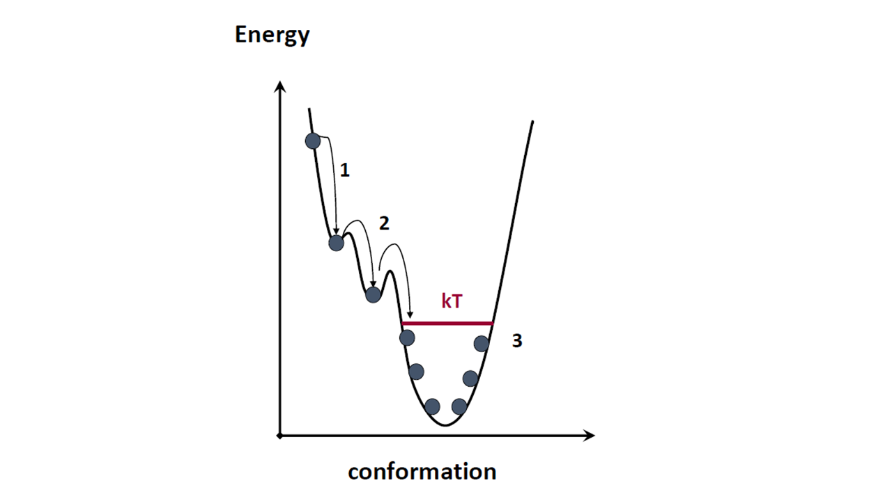
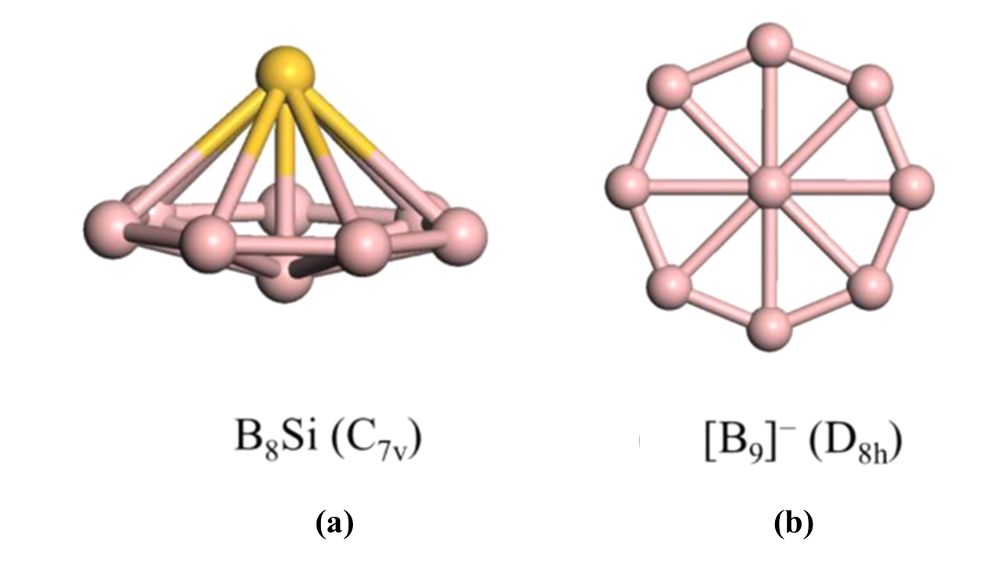
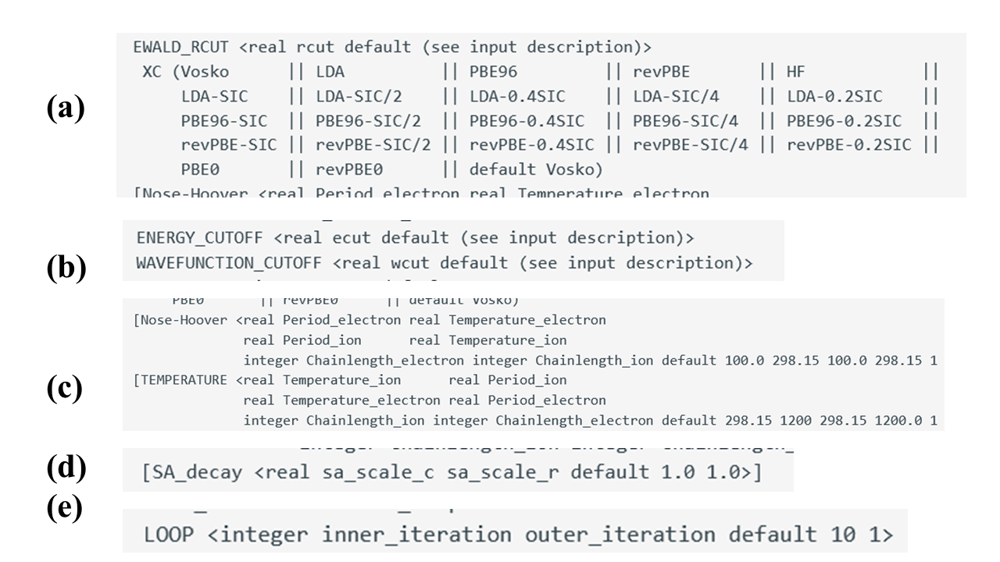

# Lab 8: Molecular Dynamics and Global Minima Search

## 1. Overview

### 1.1. Basic theory of MD.

In this Lab, we will conduct classical **molecular dynamics (MD)** simulations of some molecular systems. 
The goal of the MD simulations is obtaining **"molecular movies"**, also known as **trajectories** – the sequence of geometries reflecting 
how the atoms evolve according to Newtonian dynamics. The key equations here are:

$$ v_{i,\alpha} = \frac{dr_{i,\alpha}}{dt} = \frac{ p_{i,\alpha} }{ m_i}    Eq. 1$$

$$  m_i a_{i,\alpha} = \frac{dp_{i,\alpha}}{dt} = F_{i,\alpha}(r_{1,x}, r_{1,y}, r_{1,z},...,r_{N,x},r_{N,y},r_{N,z})    Eq. 2$$

Here, $i=1,...,N$ is the atom index, $\alpha = x, y, z$ is the index of the projection, $r$ – coordinates, $p$ – momenta, $F$ – forces, 
$v$ - velocity, $a$ - acceleration, $m$ – masses of particles.
Pay attention to the indices: $F_{i,\alpha}(r_{1,x}, r_{1,y}, r_{1,z},..., r_{N,x}, r_{N,y}, r_{N,z} )$ indicates the $\alpha$-th projection of force on atom i. 
Since the interactions are often complex (non-separable), such a force component can in principle depend on **all the coordinates of all atoms**. It is convenient 
to combine all coordinates, momenta and forces in vectors: $\mathbf r = (r_{1,x}, r_{1,y}, r_{1,z},..., r_{N,x}, r_{N,y}, r_{N,z} )$, 
$\mathbf p = (p_{1,x}, p_{1,y}, p_{1,z},..., p_{N,x}, p_{N,y}, p_{N,z} )$ or $\mathbf F = (F_{1,x}, F_{1,y}, F_{1,z},..., F_{N,x}, F_{N,y}, F_{N,z} )$. 

Thus, the goal of MD is to solve the above equations of motion in order to obtain trajectories – the sequences of geometries and momenta for different 
timesteps: $(\mathbf r(t_0 ), \mathbf p(t_0 )), (\mathbf r(t_1 ), \mathbf p(t_1 )),..., (\mathbf r(t_T ), \mathbf p(t_T ))$. Often, we mainly focus on the coordinates, 
so often one understands the word “trajectory” as the sequence of coordinates only, that is: $(\mathbf r(t_0 ), \mathbf r(t_1 ),..., \mathbf r(t_T ) )$. This is what is usually 
stored in the xyz trajectory files, although NWChem also stores the momenta. This is what can be loaded into VMD to generate the **"molecular movie"**. 
So, in essence MD is a scientific cinematography of molecules. 

Another observation here is that Eqs. 1-2 are nothing but the second Newton's law, $a_{i,\alpha} = F_{i,\alpha}/m_i$  (a – is the acceleration) and the definition of 
momentum (Eq. 1). Note that the second Newton’s law is often written in the form $F_{i,\alpha} = m_i a_{i,\alpha}, which is a bit confusing because it suggests that you 
compute the force from the acceleration. However, it won't be useful in this way. In fact, since we are interested in solving the equations of motion (e.g. Eqs. 1-2), 
we need the accelerations at different geometries of molecular system, which can be determined from the forces. It is the force that NWChem would 
compute first based on the quantum calculations.  

Now, let’s talk about how the forces are computed. In brief – they are the derivatives of the potential energy $E_{pot}$ (corresponding to a particular electronic state of interest, 
most commonly the electronic ground state) with respect to the corresponding nuclear coordinates, e.g.:
$$F_{i,\alpha} = -\frac{\partial E_{pot}}{\partial r_{i,\alpha} }.										Eq. 3$$
Since the potential energy in general represents a many-body interactions, it is a function of all coordinates of all atoms. 
This is why force is also a function of all coordinates of all atoms. 

### 1.2. Global minima search with MD (simulated annealing).

Now that we know the general idea of the MD method, let's talk about the following: one of the correctness criteria for the MD is the conservation of the so-called 
**integrals/invariants of motion** – quantities that do not change no matter how the atomic coordinates and momenta change. There are three main invariants: 

- 1. the total energy, $E_{tot} = E_{kin} + E_{pot} = const$  Here,  $E_{kin}$ – kinetic energy, $E_{pot}$ – potential energy;
- 2. the total linear momentum, $P_{\alpha} = \sum_i p_{i,\alpha} = const, \forall \alpha = x,y,z$;
- 3. the total angular momentum, $L_{\alpha} = \sum_i r_{i,\alpha} \times p_{i,\alpha} = const, \forall \alpha = x,y,z$
  
  In fact, these are not just 3, but 7 integrals of motion. **Do you see why? Ask me if you don't**. Because the total energy is conserved
  (so as the volume of the system and the number of particles), the MD is a way to generate (sample) molecular geometries from the **microcanonical (NVE) ensemble** (
  recall the statistical mechanics part of the PChem course). 

**Figure 1.** The idea of the simulated annealing strategy – having extra temperature is needed to escape the local minima, but the gradual 
removal of the excess of kinetic energy is needed to converge to the global energy minimum.   

Okay, out of these 7, we just need the first one for now – the total energy. Its conservation means that as the potential energy of the system goes down, 
the kinetic energy should go up. From the PChem course, you should know that the kinetic energy is also proportional to the microscopic (instantaneous) temperature, T. 
That is in the NVE MD simulations, as the system finds more stable configuration (geometry with more negative $E_{pot}$), the system also heats up. 
If one does not do anything about it, the thermal energy will take the system out of the more stable configuration. However, if one gradually lowers the kinetic energy 
of the system, one can eventually favor the system to stay in more stable configurations. The rate of removal of the kinetic energy excess is an important factor that 
affects the type of optimization one can conduct. If all the kinetic energy is removed instantaneously, the procedure is equivalent to the standard geometry optimization procedure. 
In this case, the resulting geometry is the local minimum geometry closest to the starting geometry. However, if the excess of kinetic energy is removed slowly, 
the system has greater chances of visiting other possible minima and eventually finding the deeper one (Figure 1). The slower the energy is removed, the higher the chances 
of finding the **global minimum** – the deepest point on the potential energy surface - although the search is also slower. Again, in the limit of no energy removal, 
one doesn't find any minimum. Usually, one also starts with the initial velocities that correspond to high temperature. The gradual "cooling" of the system is a way to 
find the global minimum. This process is called **simulated annealing (SA)**, in analogy to the annealing in materials growth.

If you ever tried growing crystals, you know that one starts with a hot overconcentrated solution of salt and lets the crystals grow from the initial seed. 
It is important to let the solution cool down slowly – then one gets larger crystals. If the solution is cooled down too fast, you’ll only get small crystals. 
Well, you also have to coordinate this cooling process with the evaporation of the solvent. Since water doesn’t evaporate too fast (but it cools down much faster), 
usually you’d get only very small crystals. 

In this Lab, we'll be using the simulated annealing approach combined with the **Car-Parrinello (CP) MD** (I’m not going into details of this method, just consider it a faster 
version of MD) to find global minima of the $B_8Si$ and $B_9^-$ clusters. The global minima of these clusters have been discussed in the review of Zhao et al[1]. 
They take the pyramidal and planar structures respectively (Figure 2). We will start with a rather random guess of initial geometry and will hopefully find the correct 
structures. Our main exploratory task will be to find the proper optimization protocol and electronic structure method to get something close to the target geometries. 

**Figure 2.** Target systems for global optimization: (a) neutral $B_8Si$ cluster; (b) negatively charged $B_9$ cluster. Figures are adapted from Zhao et al. [1]

## 2. Objectives and Tasks

The goals of this Lab will be:

1)	To find the best methodology/recipe for finding global minima of the two molecules shown in Figure 2 but starting from a distant guess geometry. 
2)	To meet the goal 1, on the practical side, you’ll be doing:
   a)	setup and conduct the simulated annealing MD calculations;
   b)	visualize the molecular movies (show the final geometries in your report, do this for every method/protocol you try);
   c)	plot the useful descriptors from the `.emotion` file, such as total or potential energy, to monitor the progress and completeness of the optimization;
  	Also, pay attention to the value of the final potential energy – but keep in mind that you may not be able to compare the energies from different functionals,
  	but can compare the energies from different recipes
3)	To find the best approach, vary the following conditions:
   
   * a)	Exchange-correlation functional: pick several variants (on your choice) from the options available for the Car-Parrinello dynamics (Figure 3a);
   
   * b)	Basis size – since these are the plane-wave calculations, the basis set size is defined by the energy and wavefunction cutoff values (Figure 3b);
   
   * c)	Parameters of the thermostat: period of the thermostat, temperature, etc. We will be using the so-called **Nose-Hoover thermostat** (Figure 3c);
   
   * d)	Perhaps even more important parameter is the rate of decay - the rate of the thermal energy excess removal (Figure 3d);
   
   * e)	The most straightforward parameter – the number of iterations: there should be enough steps for the simulation to converge to the correct result (Figure 3e);

**Figure 3.** Variation of simulation parameters in this study: (a) density functional; (b) basis set size; (c) thermostat parameters; (d) rate of annealing; (e) simulation length.

## 3. Methodology and Tools

### 3.1. Useful resources
The following references may be useful for this lab:

- [DFT](https://nwchemgit.github.io/Density-Functional-Theory-for-Molecules.html)
- [CIS, TD-HF, TD-DFT](https://nwchemgit.github.io/Excited-State-Calculations.html#sample-input)
- [Some theoretical background and examples](https://web.archive.org/web/20221103195703/https://events.prace-ri.eu/event/786/attachments/840/1256/QC-workshop-advanced.pdf)

### 3.2. Execution steps

**Geometry and basis**

## 4. Results and Discussions

The main results of the Lab would be summarized in Figures 1 and 2 as explained in the Objectives section.

## 5. References

[1] Rander, T.; Bischoff, T.; Knecht, A.; Wolter, D.; Richter, R.; Merli, A.; Möller, T. Electronic and Optical Properties of Methylated Adamantanes. J. Am. Chem. Soc. 2017, 139 (32), 11132–11137. https://doi.org/10.1021/jacs.7b05150.

