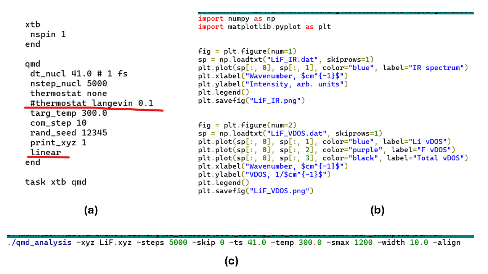

# Lab 9: Molecular Dynamics: Infrared Spectra and Vibrational Densities of States. Molecular Dynamics in the Excited States.

## 1. Overview

To this end, you should already know the basics of **molecular dynamics (MD)** from the previous Lab. In that Lab, we used a **Car-Parrinello MD (CPMD)**, which evolves electronic 
and nuclear degrees of freedom simultaneously. That is the electronic states are not necessarily fully converged at every MD timestep in the sense of typical SCF convergence 
we have seen in the former labs. Also, in Lab 8 we used the MD with the plane waves basis. Moreover, the dynamics of the boron clusters from Lab 8 was studied on the 
ground electronic state. 

In the present Lab, we will explore other flavors of MD: 1) using Gaussian-basis functions instead of the plane waves; 2) using the **Born-Oppenheimer MD (BOMD)** instead of 
the CPMD. In the BOMD, the SCF iterations are fully converged at every timestep before the nuclear forces are computed. As such, provided all other parameters are equal, 
the BOMD calculations are more expensive than the CPMD. However, the Gaussian basis sets are usually much smaller than the PW basis sets, which makes the BOMD calculations 
still feasible. Moreover, we’ll use smaller systems this time; 3) finally, we will also explore the MD not only on the ground but also in **excited electronic states**. 
In this situation, the nuclei would be evolving using the excited-state forces. In principle, NWChem has a primitive capability to conduct a **nonadiabatic molecular dynamics (NA-MD)**
simulations, in which nuclei can evolve on different PESs as electronic states switch by hopping. However, we will not be touching this capability in this course, at least for now.

The overall theme of this Lab will be focused on computing the **infrared (IR) spectra** and **vibrational densities of states (VDOS)** of molecules using the MD trajectories directly 
from the results of MD calculations. We will be doing such calculations both for the ground and excited electronic states. Furthermore, we will explore the dependence of obtained results 
on various details of the procedures: the electronic structure methodology used, the use of the geometry alignment, the use of a thermostat. Of course, we will also explore 
the dependence of the IR and VDOS spectra on the electronic state, but this is more of a genuine chemical study. 

Briefly, the calculations of the IR and VDOS spectra that will be used in this Lab are based on computing a Fourier transform of the dipole-dipole **autocorrelation function (ACF)**. 
The calculations of the ACF and the spectra are summarized in Figure 1. Note that in this figure (right panel), one uses the velocity ACF. In this case, one obtains a **power spectrum** 
which is essentially the **vibrational density of states (VDOS)**. If one uses the dipole-moment ACF (that's what we’ll be using in this Lab), one obtains the IR spectrum. 
Keeping in mind the time-energy uncertainty principle, the longer the time of simulation (of the MD trajectory), the higher the energy resolution (the smaller the distance between 
the points on the x axis of the IR/VDOS spectra) of the corresponding IR and VDOS spectra. In other words, to get clearer, sharper peaks, one has to use sufficiently long trajectories.

**Figure 1.** On calculation of autocorrelation functions and the spectra from them. 

## 2. Objectives and Tasks

The goals of this Lab will be:

1)	**Task 1:** To learn and demonstrate the **dependence** of the quality of the MD-based VDOS and IR spectra **on the simulation protocol**.
   For this part of the Lab, we will be using a simple LiF molecule and will compute IR and VDOS spectra for: a) longer MD trajectory in the NVT ensemble;
  	b) short MD trajectory in the NVE ensemble; b) longer MD trajectory in the NVE ensemble; c) longer MD trajectory in the NVE ensemble with the alignment of the geometries.
  	The calculations will be done at the xTB level (so it is fast). The results would be reported as a Figure with the 4x2 grid of panels – each row for a given simulation
  	protocol; columns are for IR and VDOS, respectively.

2)	**Task 2:** To explore the **dependence** of the IR and VDOS spectra **on the methodology**. For this step, we will be using the $(LiF)_2$ molecule studied in Lab 5.
   Using the best protocol found in step 1, compute the IR and VDOS spectra at the following levels of theory: `xTB`, `HF/6-311++G**`, `PBE/6-311++G**` and `B3LYP/6-311++G**`.
  	Report them as a Figure with the 4 x 2 grid with the four rows corresponding to the four levels of theory used and the columns corresponding to IR and VDOS spectra.
  	If it is more convenient, you can show the plots for all 4 methods in one figure using different colors, in which case the Figure could be a 2-panel figure: one panel
  	showing IR spectra and the other panel – VDOS. Summarize the IR frequencies in a Table. In this table, also report the frequencies for this molecule obtained from the
  	normal modes analysis (Lab 5 – just copy your results), as well as the reference values from the literature (see Lab 5). Since we didn’t do such calculations for the PBE
  	functional, you would only have the MD-derived IR frequencies for this method. Discuss the differences of the results computed based on the normal modes analysis (Lab 5)
  	and MD calculations (present work). Do your your current results agree well with the reference values?

3)	**Task 3:** To explore the changes in IR and VDOS spectra upon an electronic excitation. For this part, we will consider a $TiO_2$ molecule (it has a bent structure,
   similar to water). We will be using the `B3LYP/6-31G` level of theory for the ground state MD. For the adiabatic MD in the first excited electronic state, we will be using
  	the Tamm-Dancoff TD-DFT approach with the `B3LYP` functional and `6-31G` basis set. Report the results as a Figure with the 2 x 2 grid of panels: rows correspond to
  	the ground or excited-state MD, and columns show IR and VDOS. 

## 3. Methodology and Tools

### 3.1. Useful resources
The following references may be useful for this lab:

- [Gaussian basis AIMD](https://nwchemgit.github.io/Gaussian-Basis-AIMD.html)

## 3.2. Execution steps

**Task 1: Simulation recipe.**

In this step, use LiF structure optimized at one of the levels of theory previously. To set up the MD calculations and run it, use the input similar to that shown in Figure 2a. 
The integration time step is set to 1 fs (41 atomic units of time) – is a reasonable integration time step. In this example, only 5000 steps are requested. With xTB, the calculations 
are very fast, so you may want to request even more steps (in the later steps, you may use a subset of a longer trajectory to mimic a very short trajectory simulation). 
The calculations with methods other than xTB may be more demanding, so 5000 steps may be quite a good number – determine it based on your experience. The thermostat is 
varied by the `thermostat` section. The `none` option disables thermostats, so you conduct an MD simulation in an NVE ensemble. If you choose a thermostat, e.g. Langevin, 
you need to use a parameter that describes the thermostat property. It can be a frequency of system-thermostat interaction, a friction coefficient, etc. (see the NWChem 
documentation for more information). In the limit of a very small frequency of system-thermostat interaction, one essentially conducts an NVE (no thermostat) simulation. 
In the opposite limit of a very high frequency of the system-thermostat interaction, the motion in the system becomes more random and less realistic. For instance, the example 
in Figure 2 will lead to a very unphysical dynamics – run it and see. Set up the needed temperature. Include the option to remove the center of mass (COM) motion, you can use the 
random seed or not. It is important to save the trajectory information, which is done with `print_xyz 1`, which will save all the snapshots of the MD trajectory. 
Finally, for the LiF molecule, we also have to add the keyword `linear` since this is a linear molecule. Otherwise, you would get an error message. 

**Figure 2.** The key inputs, scripts, and commands needed for the Lab: (a) the setup of the quantum MD (QMD, same as AIMD or BOMD) simulations with xTB and in 
the NVE ensemble; (b) the Python script for plotting IR spectrum and VDOS plots; (c) the command to produce the spectra from the MD trajectory information. 

In this example, the trajectory is saved in the `LiF.xyz` file. The next step of our workflow is to compute the dipole-dipole ACF and then the IR spectrum as well as the VDOS. 
This is done using the pre-compiled binary **qmd_analysis** which will be shared with you. An example of using this code is shown in Figure 2c. The keywords and parameters 
are well-described on the NWChem documentation website. Make sure you use the same integration time-step (`-ts`) as in the MD input (Figure 2a) and the same temperature. 
You can control how many initial steps of the trajectory you want to exclude from the analysis (`-skip`, e.g. it was a thermalization stage) and how many steps you want to 
include (`-steps`). **These are some of the things you need to vary in this Lab:** use small or large number of steps and compare the shapes and resolution of the produced 
spectra. As a more specific guidance, consider using only, say, 100 steps as a small number. The large number could be as large as, say, 15000 steps, but something like 5000 steps 
should be long enough too. Also, do the calculations using or not the `-align` option at the end of Figure 2c. Again, compare the corresponding spectra. 
The execution of the `qmd_analysis` tool will generate new files “LiF_IR.dat” and “LiF_VDOS.dat”. These text files can then be visualized using the provided `plot.py` 
script by running the `python plot.py`. This script will generate the “LiF_IR.png” and “LiF_VDOS.png” files. 

## 4. Results and Discussions

## 5. References

[1]	Zhao, J.; Du, Q.; Zhou, S.; Kumar, V. Endohedrally Doped Cage Clusters. Chem. Rev. 2020, 120 (17), 9021–9163. https://doi.org/10.1021/acs.chemrev.9b00651

