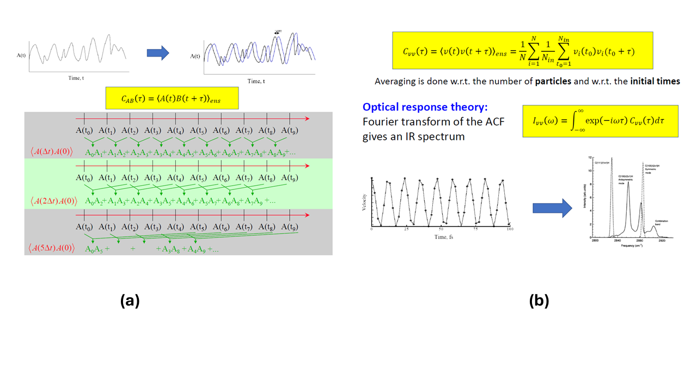

# Lab 9: Molecular Dynamics: Infrared Spectra and Vibrational Densities of States. Molecular Dynamics in the Excited States.

## 1. Overview

### 1.1. Basic theory of MD.

**Figure 1.** The idea of the simulated annealing strategy – having extra temperature is needed to escape the local minima, but the gradual 
removal of the excess of kinetic energy is needed to converge to the global energy minimum.   

## 2. Objectives and Tasks

The goals of this Lab will be:

## 3. Methodology and Tools

### 3.1. Useful resources
The following references may be useful for this lab:

- [MD](https://nwchemgit.github.io/Plane-Wave-Density-Functional-Theory.html#car-parrinello)  - this is the section that explains the inputs to the NWPW
  calculations and the Car-Parrinello inputs in particular.
- [Tutorial2](https://nwchemgit.github.io/Plane-Wave-Density-Functional-Theory.html#nwpw-tutorial-2-using-pspw-car-parrinello-simulated-annealing-simulations-to-optimize-structures) -
  We will be closely following it. It won't hurt to read the general section of this tutorial, but we'll be doing the constant temperature calculations from the example b;
- [example b](https://nwchemgit.github.io/Plane-Wave-Density-Functional-Theory.html#simulated-annealing-using-constant-temperature-simulation) 
  The section contains the example input and output files (Figure 4a).

## 4. Results and Discussions

## 5. References

[1]	Zhao, J.; Du, Q.; Zhou, S.; Kumar, V. Endohedrally Doped Cage Clusters. Chem. Rev. 2020, 120 (17), 9021–9163. https://doi.org/10.1021/acs.chemrev.9b00651

